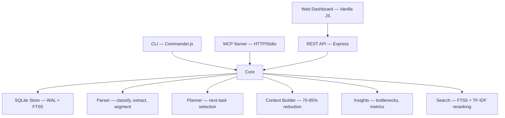

# @diegonogueiradev_/mcp-graph

[](https://github.com/DiegoNogueiraDev/mcp-graph-workflow/actions/workflows/ci.yml)
[](https://www.npmjs.com/package/@diegonogueiradev_/mcp-graph)
[](https://nodejs.org)
[](https://opensource.org/licenses/MIT)
[](https://www.typescriptlang.org/)
[](CONTRIBUTING.md)

A local-first CLI tool (TypeScript) that converts PRD text files into persistent execution graphs (SQLite), enabling structured, token-efficient agentic workflows.

## Features

- **PRD to Graph** — Parse PRD text files into structured task graphs with nodes and edges
- **Local-first** — SQLite persistence, zero external dependencies, no Docker
- **Smart Routing** — `next` command suggests the best task based on priority, dependencies, and blockers
- **Context Compression** — Reduce LLM context payload by 70-85% via structural summarization
- **MCP Protocol** — 26 tools accessible via HTTP or Stdio transport
- **Web Dashboard** — Real-time browser UI with Mermaid diagrams, backlog management, and insights
- **REST API** — Full CRUD + search + import + insights via Express
- **Cross-platform** — Windows, macOS, and Linux compatible

## Quick Start

### As MCP Server (recommended)

Add to your Claude Code `.mcp.json` or Cursor MCP config:

```json
{
  "mcpServers": {
    "mcp-graph": {
      "command": "npx",
      "args": ["@diegonogueiradev_/mcp-graph"]
    }
  }
}
```

Then use the tools via your MCP client:

```
init → import_prd → list → next → update_status → stats
```

### From source

```bash
git clone <repo-url>
cd mcp-graph-workflow
npm install
npm run build
npm run dev          # Start HTTP server + dashboard
npm run dev:stdio    # Start MCP Stdio server
```

### CLI

```bash
mcp-graph init                    # Initialize project
mcp-graph import docs/my-prd.md  # Import PRD file
mcp-graph stats                  # Show graph statistics
mcp-graph stats --json           # JSON output
mcp-graph serve --port 3000      # Start dashboard
```

## Architecture



```
src/
  cli/             # Commander.js commands (thin orchestration)
  core/
    graph/         # SQLite persistence + queries + Mermaid export
    importer/      # PRD import pipeline
    parser/        # classify, extract, normalize, segment
    planner/       # next-task selection logic
    context/       # compact context builder
    insights/      # bottleneck detection, metrics
    search/        # FTS5 + TF-IDF search
    events/        # SSE event bus
    store/         # SQLite store, migrations
    config/        # Configuration loader
    docs/          # Docs cache syncer
    utils/         # errors, fs, id, logger, time
  api/             # Express REST API routes + middleware
  mcp/             # MCP server (HTTP + Stdio) + tool wrappers
  schemas/         # Zod v4 schemas
  web/public/      # Dashboard (HTML, CSS, vanilla JS)
  tests/           # Vitest unit/integration + Playwright E2E
```

## MCP Tools

| Tool | Description |
|---|---|
| `init` | Initialize project and SQLite database |
| `import_prd` | Parse PRD file and generate task graph |
| `list` | List nodes filtered by type/status/sprint |
| `show` | Show node details with edges and children |
| `next` | Suggest next task based on priority and dependencies |
| `update_status` | Update node status (backlog/ready/in_progress/blocked/done) |
| `update_node` | Edit node fields (title, description, priority, tags, etc.) |
| `stats` | Show graph statistics and context reduction metrics |
| `context` | Build compact context payload for a specific task |
| `search` | Full-text search across nodes |
| `rag_context` | RAG-based contextual search via FTS5+TF-IDF |
| `add_node` | Add a new node to the graph |
| `add_edge` | Add an edge between nodes |
| `delete_node` | Delete node with cascade edge cleanup |
| `delete_edge` | Delete an edge |
| `list_edges` | List edges filtered by node or type |
| `move_node` | Move node to a different parent |
| `clone_node` | Clone a node (optionally with children) |
| `bulk_update_status` | Update status of multiple nodes at once |
| `decompose` | Detect large tasks and suggest breakdown |
| `velocity` | Calculate team velocity and sprint metrics |
| `dependencies` | Analyze dependency chains, critical path, blockers |
| `export_graph` | Export the complete graph as JSON |
| `export_mermaid` | Export the graph as a Mermaid diagram (flowchart or mindmap) |
| `create_snapshot` | Create a named snapshot of the current graph state |
| `restore_snapshot` | Restore graph from a snapshot |
| `list_snapshots` | List available snapshots |

## REST API

All endpoints under `/api/v1/`:

| Method | Endpoint | Description |
|--------|----------|-------------|
| POST | `/project/init` | Initialize project |
| GET | `/nodes` | List all nodes |
| POST | `/nodes` | Create node |
| GET | `/edges` | List edges |
| POST | `/edges` | Create edge |
| GET | `/stats` | Graph statistics |
| GET | `/search?q=term` | Full-text search |
| POST | `/import` | Import PRD file (multipart) |
| GET | `/graph/document` | Full graph document |
| GET | `/graph/mermaid` | Mermaid diagram |
| GET | `/insights/bottlenecks` | Bottleneck report |
| GET | `/context/preview?nodeId=x` | Compact context for node |
| GET | `/docs` | Docs cache entries |
| GET | `/events` | SSE real-time events |
| GET | `/integrations/status` | Integration status (Serena, GitNexus) |
| GET | `/skills` | Available skills |

## Web Dashboard

The dashboard runs at `http://localhost:3000` via `mcp-graph serve` and provides 5 tabs:

1. **Graph** — Interactive Mermaid diagram with filters (status, type, direction, format), node table with search/sort, and detail panel
2. **PRD & Backlog** — PRD source view, backlog list, next task badge, progress bars per epic
3. **Code Graph** — Integration with GitNexus/Serena code analysis
4. **Knowledge** — Docs cache and context preview
5. **Insights** — Bottleneck detection, metrics, and reports

Real-time updates via Server-Sent Events (SSE). Dark/light theme toggle.

## Testing

```bash
npm test               # Unit + integration tests (Vitest)
npm run test:watch     # Watch mode
npm run test:e2e       # Browser E2E tests (Playwright)
npm run test:coverage  # Coverage report (V8)
npm run test:bench     # Benchmark tests
npm run test:all       # All tests (unit + E2E)
```

See [docs/TEST-GUIDE.md](docs/TEST-GUIDE.md) for the full testing guide.

## How It Works

1. **Parse** — Read PRD text, normalize, segment by headings, classify blocks heuristically
2. **Transform** — Convert blocks to nodes (epic, task, subtask, requirement, constraint, risk) with edges (depends_on, parent_of, blocks, related_to)
3. **Persist** — Store graph in local SQLite with WAL mode, FTS5 indexes, and snapshots
4. **Execute** — Route tasks by priority, dependency resolution, and blocker analysis
5. **Compress** — Generate minimal context payloads for LLM consumption (70-85% token reduction)

## Node Types

`epic` | `task` | `subtask` | `requirement` | `constraint` | `milestone` | `acceptance_criteria` | `risk` | `decision`

## Status Flow

```
backlog → ready → in_progress → done
                → blocked
```

## XP Anti-Vibe-Coding Workflow

The project follows an anti-vibe-coding methodology based on Extreme Programming (XP). Discipline over intuition. Every line of code has a tested purpose, and the execution graph ensures no progress is lost between sessions.

### Why a Graph?

| Problem | List/Kanban | Graph (mcp-graph) |
|---------|------------|-------------------|
| Task dependencies | Invisible or manual | Explicit edges: `blocks`, `depends_on`, `parent_of` |
| Execution order | Decided by dev each time | `next` auto-resolves based on priority + dependencies |
| AI context | Dev explains everything | `context` generates compact payload (70-85% fewer tokens) |
| Session continuity | Lost — "where was I?" | `stats` + `list` show exact state |
| Hierarchical decomposition | Flat | Tree: PRD → Feature → Story → Task → Subtask |

### Key Skills

| Skill | Purpose |
|-------|---------|
| `/xp-bootstrap` | Sequential workflow: Isolation → Foundation → TDD → Implementation → Optimization → Interface → Deploy |
| `/project-scaffold` | Auto-setup: `.mcp.json` + `CLAUDE.md` template + `.claude/rules/` + mcp-graph init |
| `/dev-flow-orchestrator` | Continuous XP cycle: ANALYZE → DESIGN → PLAN → IMPLEMENT → VALIDATE → REVIEW → HANDOFF → LISTENING |
| `/track-with-mcp-graph` | Keep graph in sync with real work state |

## Contributing

1. Fork the repository
2. Create a feature branch: `git checkout -b feature/my-feature`
3. Follow TDD: write failing test first, then implement
4. Ensure all checks pass: `npm run build && npm test && npm run test:e2e`
5. Submit a PR with clear description

## Documentation

| Document | Description |
|---|---|
| [CLAUDE.md](CLAUDE.md) | AI agent instructions, conventions, and rules |
| [docs/ARCHITECTURE-GUIDE.md](docs/ARCHITECTURE-GUIDE.md) | Complete architecture guide |
| [docs/TEST-GUIDE.md](docs/TEST-GUIDE.md) | Testing guide and best practices |

## License

[MIT](LICENSE)
