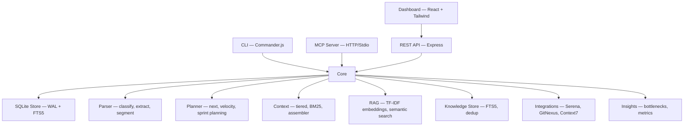

# @diegonogueiradev_/mcp-graph

[](https://github.com/DiegoNogueiraDev/mcp-graph-workflow/actions/workflows/ci.yml)
[](https://www.npmjs.com/package/@diegonogueiradev_/mcp-graph)
[](https://nodejs.org)
[](https://opensource.org/licenses/MIT)
[](https://www.typescriptlang.org/)
[](CONTRIBUTING.md)

A local-first CLI tool (TypeScript) that converts PRD text files into persistent execution graphs (SQLite), with an integrated knowledge store, RAG pipeline, and multi-agent integration mesh — enabling structured, token-efficient agentic workflows. 26 MCP tools, 17 REST API routers, 630+ tests.

## Table of Contents

- [Features](#features)
- [Quick Start](#quick-start)
- [Architecture](#architecture)
- [MCP Tools (26)](#mcp-tools-26)
- [REST API (17 routers)](#rest-api-17-routers)
- [CLI Commands (5)](#cli-commands-5)
- [Knowledge Pipeline](#knowledge-pipeline)
- [Integrations](#integrations)
- [Web Dashboard](#web-dashboard)
- [Testing](#testing)
- [Dev Flow](#dev-flow)
- [XP Anti-Vibe-Coding](#xp-anti-vibe-coding)
- [Documentation](#documentation)
- [Contributing](#contributing)
- [License](#license)

## Features

- **PRD to Graph** — Parse PRD text files (.md, .txt, .pdf, .html) into structured task graphs
- **Local-first** — SQLite persistence, zero external dependencies, no Docker
- **26 MCP Tools** — Full graph lifecycle via HTTP or Stdio transport
- **17 REST API Routers** — CRUD, search, import, knowledge, RAG, integrations, insights
- **Knowledge Store** — Unified store with FTS5, SHA-256 dedup, 5 source types
- **RAG Pipeline** — TF-IDF embeddings, cosine similarity, 100% local (no external APIs)
- **Tiered Context** — 3-level compression achieving 70-85% token reduction
- **Smart Routing** — `next` suggests best task based on priority, dependencies, and knowledge coverage
- **Sprint Planning** — `plan_sprint` with velocity-based estimates, risk assessment, task ordering
- **Integration Mesh** — Serena, GitNexus, Context7, Playwright working together via event bus
- **Web Dashboard** — React + Tailwind CSS with interactive graph, backlog, code graph, and insights
- **630+ Tests** — Unit, integration, E2E browser (Playwright), benchmarks
- **Cross-platform** — Windows, macOS, and Linux compatible

## Quick Start

### As MCP Server (recommended)

Add to your Claude Code `.mcp.json` or Cursor MCP config:

```json
{
  "mcpServers": {
    "mcp-graph": {
      "command": "npx",
      "args": ["@diegonogueiradev_/mcp-graph"]
    }
  }
}
```

Then use the tools via your MCP client:

```
init → import_prd → list → next → update_status → stats
```

### From source

```bash
git clone <repo-url>
cd mcp-graph-workflow
npm install
npm run build
npm run dev              # Start HTTP server + dashboard + GitNexus auto-analyze
npm run dev:stdio        # Start MCP Stdio server (no dashboard)
```

Open `http://localhost:3000` to access the dashboard. GitNexus analysis starts automatically if a `.git/` directory is detected.

### CLI

```bash
mcp-graph init                    # Initialize project
mcp-graph import docs/my-prd.md  # Import PRD file
mcp-graph index                  # Rebuild knowledge indexes + embeddings
mcp-graph stats                  # Show graph statistics
mcp-graph serve --port 3000      # Start dashboard
```

## Architecture



```
src/
  cli/               # Commander.js commands (5) — thin orchestration
  core/
    graph/           # SQLite persistence + queries + Mermaid export
    importer/        # PRD import pipeline
    parser/          # classify, extract, normalize, segment (8 modules)
    planner/         # next-task, velocity, decompose, planning-report (6 modules)
    context/         # compact, tiered, BM25, assembler, RAG context (6 modules)
    rag/             # TF-IDF embeddings, indexers, semantic query (7 modules)
    store/           # SQLite store, migrations, knowledge store (3 modules)
    integrations/    # Serena, GitNexus, orchestrator, enriched context (7 modules)
    docs/            # Stack detector, Context7 fetcher, cache, syncer (4 modules)
    capture/         # Web capture, validate runner, content extractor (3 modules)
    insights/        # Bottleneck detection, metrics, skill recommender (3 modules)
    search/          # FTS5 + TF-IDF search + tokenizer (3 modules)
    events/          # GraphEventBus + event types (2 modules)
    config/          # Configuration schema + loader (2 modules)
    utils/           # errors, fs, id, logger, time (5 modules)
  api/               # Express REST API — 17 routers, 44 endpoints
  mcp/               # MCP server (HTTP + Stdio) + 26 tool wrappers
  schemas/           # Zod v4 schemas (node, edge, graph, knowledge)
  web/dashboard/     # React + Tailwind + React Flow dashboard
  tests/             # 69 Vitest files + 7 Playwright E2E specs
```

See [docs/ARCHITECTURE-GUIDE.md](docs/ARCHITECTURE-GUIDE.md) for the complete architecture guide.

## MCP Tools (26)

| Category | Tool | Description |
|----------|------|-------------|
| **Graph CRUD** | `init` | Initialize project and SQLite database |
| | `import_prd` | Parse PRD file and generate task graph |
| | `add_node` | Create a node in the graph |
| | `update_node` | Edit node fields (title, description, priority, tags, etc.) |
| | `delete_node` | Delete node with cascade edge cleanup |
| | `edge` | Create, delete, or list edges between nodes |
| | `move_node` | Move node to a different parent |
| | `clone_node` | Clone a node (optionally with children) |
| | `export` | Export graph as JSON or Mermaid diagram |
| **Querying** | `list` | List nodes filtered by type/status/sprint |
| | `show` | Show node details with edges and children |
| | `search` | Full-text search with BM25 ranking |
| | `rag_context` | Semantic search with token-budgeted context |
| **Planning** | `next` | Suggest next task by priority + dependencies |
| | `update_status` | Update node status |
| | `bulk_update_status` | Update status of multiple nodes |
| | `decompose` | Detect large tasks and suggest breakdown |
| | `velocity` | Calculate sprint velocity metrics |
| | `dependencies` | Analyze dependency chains, cycles, critical path |
| | `plan_sprint` | Generate sprint planning report |
| **Knowledge** | `context` | Build compact context payload for a task |
| | `reindex_knowledge` | Rebuild knowledge indexes + embeddings |
| | `sync_stack_docs` | Auto-detect stack + fetch docs via Context7 |
| **Validation** | `validate_task` | Browser-based task validation with A/B compare |
| **Snapshots & Stats** | `stats` | Graph statistics + compression metrics |
| | `snapshot` | Create, restore, or list graph snapshots |

See [docs/MCP-TOOLS-REFERENCE.md](docs/MCP-TOOLS-REFERENCE.md) for full parameter documentation.

## REST API (17 routers)

| Router | Key Endpoints |
|--------|---------------|
| **Project** | `GET /project`, `POST /project/init` |
| **Nodes** | `GET/POST/PATCH/DELETE /nodes` |
| **Edges** | `GET/POST/DELETE /edges` |
| **Stats** | `GET /stats` |
| **Search** | `GET /search?q=term` |
| **Graph** | `GET /graph`, `GET /graph/mermaid` |
| **Import** | `POST /import` (multipart) |
| **Knowledge** | `GET/POST/DELETE /knowledge`, `POST /knowledge/search` |
| **RAG** | `POST /rag/query`, `POST /rag/reindex`, `GET /rag/stats` |
| **Integrations** | `GET /integrations/status`, enriched context, knowledge status |
| **GitNexus** | `GET /gitnexus/status`, `POST /gitnexus/query\|context\|impact` |
| **Insights** | `GET /insights/bottlenecks\|recommendations\|metrics` |
| **Context** | `GET /context/preview` |
| **Capture** | `POST /capture` |
| **Docs** | `GET /docs`, `POST /docs/sync` |
| **Events** | `GET /events` (SSE stream) |
| **Skills** | `GET /skills` |

See [docs/REST-API-REFERENCE.md](docs/REST-API-REFERENCE.md) for full endpoint documentation.

## CLI Commands (5)

| Command | Description |
|---------|-------------|
| `mcp-graph init` | Initialize project + SQLite database |
| `mcp-graph import <file>` | Import PRD file into graph |
| `mcp-graph index` | Rebuild knowledge indexes and embeddings |
| `mcp-graph stats [--json]` | Show graph statistics |
| `mcp-graph serve [--port]` | Start HTTP server + MCP + dashboard |

## Knowledge Pipeline

```
Sources                Knowledge Store        Embeddings            Context
┌─────────────┐       ┌──────────────┐       ┌──────────────┐     ┌──────────────┐
│ Serena      │──────▶│ FTS5 search  │──────▶│ TF-IDF       │────▶│ Tiered       │
│ Context7    │       │ SHA-256 dedup│       │ Cosine sim   │     │ BM25 filter  │
│ Web capture │       │ 5 source     │       │ 100% local   │     │ Token budget │
│ Uploads     │       │   types      │       │              │     │ 70-85% less  │
└─────────────┘       └──────────────┘       └──────────────┘     └──────────────┘
```

The knowledge pipeline indexes content from multiple sources into a unified store, builds TF-IDF embeddings for semantic search, and assembles token-budgeted context with three compression tiers:

- **Tier 1 — Summary** (~20 tok/node): Title + status
- **Tier 2 — Standard** (~150 tok/node): + description + dependencies
- **Tier 3 — Deep** (~500+ tok/node): + acceptance criteria + knowledge

See [docs/KNOWLEDGE-PIPELINE.md](docs/KNOWLEDGE-PIPELINE.md) for the complete pipeline documentation.

## Integrations

| Integration | Role | Key Features |
|-------------|------|-------------|
| **Serena** | Code analysis + memory | Memory reading, code indexing, RAG query (FTS/semantic/hybrid) |
| **GitNexus** | Git graph analysis | Symbol query, impact analysis, dependency visualization |
| **Context7** | Library docs fetching | Stack auto-detection, docs sync, local caching |
| **Playwright** | Browser automation | Task validation, A/B testing, content capture + indexing |

All integrations are coordinated by the `IntegrationOrchestrator` — an event-driven mesh that listens to `GraphEventBus` events and triggers cross-integration workflows automatically.

See [docs/INTEGRATIONS-GUIDE.md](docs/INTEGRATIONS-GUIDE.md) for detailed integration documentation.

## Web Dashboard

### Starting the Dashboard

```bash
# From source
npm run dev              # Start Express API + MCP + Dashboard + GitNexus auto-analyze

# Or via CLI
mcp-graph serve --port 3000
```

The `serve` command starts:
- **Express REST API** on the configured port (default 3000)
- **MCP server** (HTTP transport)
- **React dashboard** served at `http://localhost:3000`
- **GitNexus auto-analyze** — automatically detects `.git/`, checks index, runs `gitnexus analyze`, and starts `gitnexus serve`

### GitNexus Auto-Analyze

On startup, the server automatically:
1. Checks if the working directory is a git repository (`.git/` exists)
2. Checks if GitNexus has already indexed the codebase (`.gitnexus/` exists)
3. If not indexed, runs `gitnexus analyze` (up to 5 min for large codebases)
4. Starts `gitnexus serve` on the configured port (default 3737)

The dashboard Code Graph tab shows real-time status of the analysis phase.

To disable auto-analyze:
```bash
# Via environment variable
GITNEXUS_AUTO_START=false npm run dev

# Or in mcp-graph.config.json
{ "integrations": { "gitnexusAutoStart": false } }
```

### Configuration

Create a `mcp-graph.config.json` in the project root:

```json
{
  "port": 3000,
  "dbPath": ".mcp-graph",
  "integrations": {
    "gitnexusPort": 3737,
    "gitnexusAutoStart": true
  }
}
```

Environment variable overrides: `MCP_PORT`, `GITNEXUS_PORT`, `GITNEXUS_AUTO_START`.

### Dashboard Tabs

1. **Graph** — Interactive React Flow diagram with filters, node table with search/sort, and detail panel
2. **PRD & Backlog** — PRD backlog list with progress tracking
3. **Code Graph** — GitNexus code dependency visualization with query interface
4. **Insights** — Bottleneck detection, velocity metrics, and reports
5. **Benchmark** — Performance benchmark results and comparisons

Built with React 19 + TypeScript + Tailwind CSS + React Flow. Real-time updates via SSE. Dark/light theme.

## Testing

```bash
npm test               # Unit + integration tests (Vitest)
npm run test:watch     # Watch mode
npm run test:e2e       # Browser E2E tests (Playwright)
npm run test:coverage  # Coverage report (V8)
npm run test:bench     # Benchmark tests
npm run test:all       # All tests (unit + E2E)
```

**630+ tests** across 69 Vitest files + 7 Playwright E2E specs covering: parser, store, knowledge, RAG, context compression, planner, integrations, API endpoints, MCP tools, CLI commands, and browser flows.

See [docs/TEST-GUIDE.md](docs/TEST-GUIDE.md) for the full testing guide.

## Dev Flow

The project follows an 8-phase development lifecycle:

```
ANALYZE → DESIGN → PLAN → IMPLEMENT → VALIDATE → REVIEW → HANDOFF → LISTENING
```

Each phase is supported by specific MCP tools and skills. The execution graph ensures no progress is lost between sessions.

See [docs/LIFECYCLE.md](docs/LIFECYCLE.md) for the complete lifecycle documentation.

## XP Anti-Vibe-Coding

The project follows an anti-vibe-coding methodology based on Extreme Programming (XP). Discipline over intuition. Every line of code has a tested purpose.

### Why a Graph?

| Problem | List/Kanban | Graph (mcp-graph) |
|---------|------------|-------------------|
| Task dependencies | Invisible or manual | Explicit edges: `blocks`, `depends_on`, `parent_of` |
| Execution order | Decided by dev each time | `next` auto-resolves based on priority + dependencies |
| AI context | Dev explains everything | `context` generates compact payload (70-85% fewer tokens) |
| Session continuity | Lost — "where was I?" | `stats` + `list` show exact state |
| Hierarchical decomposition | Flat | Tree: PRD → Feature → Story → Task → Subtask |

### Key Skills

| Skill | Purpose |
|-------|---------|
| `/xp-bootstrap` | Sequential workflow: Isolation → Foundation → TDD → Implementation → Optimization → Interface → Deploy |
| `/project-scaffold` | Auto-setup: `.mcp.json` + `CLAUDE.md` template + `.claude/rules/` + mcp-graph init |
| `/dev-flow-orchestrator` | Continuous XP cycle: ANALYZE → DESIGN → PLAN → IMPLEMENT → VALIDATE → REVIEW → HANDOFF → LISTENING |
| `/track-with-mcp-graph` | Keep graph in sync with real work state |

See [docs/LIFECYCLE.md](docs/LIFECYCLE.md) for the full methodology guide.

## Documentation

| Document | Description |
|----------|-------------|
| [CLAUDE.md](CLAUDE.md) | AI agent instructions, conventions, and rules |
| [docs/ARCHITECTURE-GUIDE.md](docs/ARCHITECTURE-GUIDE.md) | System layers, module inventory, data flows |
| [docs/MCP-TOOLS-REFERENCE.md](docs/MCP-TOOLS-REFERENCE.md) | 26 MCP tools with full parameter reference |
| [docs/REST-API-REFERENCE.md](docs/REST-API-REFERENCE.md) | 17 routers, 44 endpoints with examples |
| [docs/KNOWLEDGE-PIPELINE.md](docs/KNOWLEDGE-PIPELINE.md) | Knowledge Store, RAG, embeddings, context assembly |
| [docs/INTEGRATIONS-GUIDE.md](docs/INTEGRATIONS-GUIDE.md) | Serena, GitNexus, Context7, Playwright |
| [docs/TEST-GUIDE.md](docs/TEST-GUIDE.md) | Test pyramid, categories, best practices |
| [docs/LIFECYCLE.md](docs/LIFECYCLE.md) | 8-phase development lifecycle + XP methodology |

## Contributing

1. Fork the repository
2. Create a feature branch: `git checkout -b feature/my-feature`
3. Follow TDD: write failing test first, then implement
4. Ensure all checks pass: `npm run build && npm test && npm run test:e2e`
5. Submit a PR with clear description

## License

[MIT](LICENSE)
