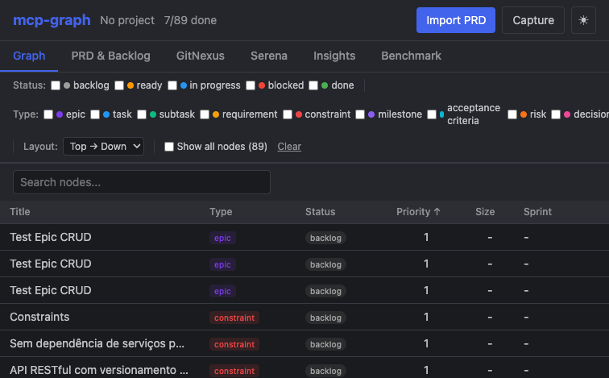
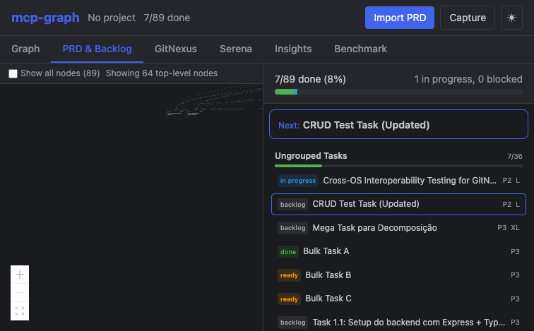
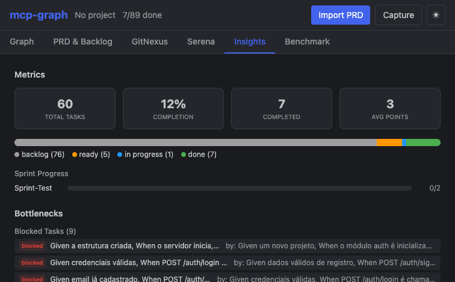
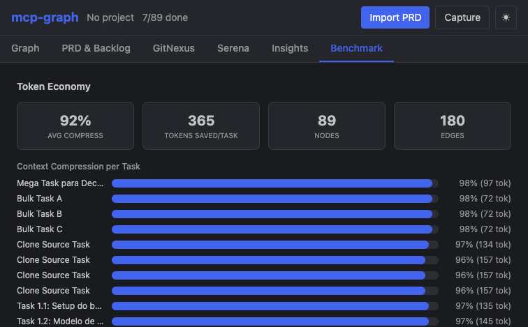

# @mcp-graph-workflow/mcp-graph

[](https://github.com/DiegoNogueiraDev/mcp-graph-workflow/actions/workflows/ci.yml)
[](https://www.npmjs.com/package/@mcp-graph-workflow/mcp-graph)
[](https://nodejs.org)
[](https://opensource.org/licenses/MIT)
[](https://www.typescriptlang.org/)
[](CONTRIBUTING.md)
[](https://www.npmjs.com/package/@mcp-graph-workflow/mcp-graph)
[](https://github.com/DiegoNogueiraDev/mcp-graph-workflow/stargazers)
[](https://github.com/DiegoNogueiraDev/mcp-graph-workflow/network)

**Automate project planning from PRD to execution.** Local-first CLI that converts product requirement documents into structured task graphs with AI-powered context, semantic search, and multi-agent orchestration.

<p align="center">
  
</p>

## Quick Start

### GitHub Copilot (VS Code)

Create `.vscode/mcp.json` in your project:

```json
{
  "servers": {
    "mcp-graph": {
      "type": "stdio",
      "command": "npx",
      "args": ["-y", "@mcp-graph-workflow/mcp-graph"]
    }
  }
}
```

Enable **Agent Mode** in Copilot Chat, then use the tools: `init → import_prd → next → context → update_status`

### Claude Code / Cursor / IntelliJ

Add to `.mcp.json`:

```json
{
  "mcpServers": {
    "mcp-graph": {
      "command": "npx",
      "args": ["-y", "@mcp-graph-workflow/mcp-graph"]
    }
  }
}
```

### Windsurf / Zed / Other MCP Clients

Use stdio transport with:

```
npx -y @mcp-graph-workflow/mcp-graph
```

### From Source

```bash
git clone <repo-url> && cd mcp-graph-workflow
npm install && npm run build
npm run dev        # HTTP + dashboard at localhost:3000
```

> For detailed setup, see [Getting Started](docs/GETTING-STARTED.md).

## Features

- **PRD → Task Graph** — Import .md, .txt, .pdf, or .html documents and auto-generate hierarchical task trees
- **AI-Optimized Context** — 70-85% token reduction with tiered compression (summary/standard/deep)
- **Smart Task Routing** — `next` suggests the best task based on priority, dependencies, and blockers
- **Semantic Search + RAG** — Full-text BM25 search + TF-IDF embeddings, 100% local
- **Sprint Planning** — Velocity metrics, capacity-based planning, risk assessment
- **Web Dashboard** — Interactive graph visualization, backlog tracking, code intelligence, insights
- **Multi-Agent Mesh** — Serena + GitNexus + Context7 + Playwright coordinated via event bus, with phase-aware MCP suggestions
- **Environment Doctor** — `mcp-graph doctor` validates Node.js, SQLite, permissions, integrations, and suggests fixes
- **Local-First** — SQLite persistence, zero external dependencies, cross-platform

## Who is this for?

| Persona | Use Case |
|---------|----------|
| **AI Engineers** | Structured agentic workflows with token-efficient context |
| **Tech Leads** | PRD decomposition into trackable, dependency-aware task graphs |
| **Solo Developers** | Project planning with AI-powered suggestions and progress tracking |
| **Teams using Copilot/Claude/Cursor** | MCP-native tool integration for AI-assisted development |

## Dashboard

6 tabs: **Graph** (interactive diagram + filters) · **PRD & Backlog** (progress tracking) · **GitNexus** (code intelligence) · **Serena** (code memories) · **Insights** (bottlenecks + metrics) · **Benchmark** (token economy)

<p align="center">
  
</p>

<p align="center">
  
</p>

<p align="center">
  
</p>

```bash
mcp-graph serve --port 3000    # or: npm run dev
```

## Tools & API

| | Count | Reference |
|---|---|---|
| **MCP Tools** | 26 | [MCP-TOOLS-REFERENCE.md](docs/MCP-TOOLS-REFERENCE.md) |
| **REST Endpoints** | 44 (17 routers) | [REST-API-REFERENCE.md](docs/REST-API-REFERENCE.md) |
| **CLI Commands** | 6 | `init`, `import`, `index`, `stats`, `serve`, `doctor` |

## Integrations

| Integration | Role |
|-------------|------|
| **Serena** | Code analysis, memory, symbol navigation |
| **GitNexus** | Git graph, impact analysis, dependency visualization |
| **Context7** | Up-to-date library documentation fetching |
| **Playwright** | Browser-based task validation and A/B testing |

All coordinated by an event-driven `IntegrationOrchestrator`. See [INTEGRATIONS-GUIDE.md](docs/INTEGRATIONS-GUIDE.md).

## Testing

**910+ tests** across 101 Vitest files + 11 Playwright E2E specs.

```bash
npm test            # Unit + integration
npm run test:e2e    # Browser E2E (Playwright)
npm run test:all    # Everything
```

## Documentation

| Document | Description |
|----------|-------------|
| [Getting Started](docs/GETTING-STARTED.md) | Step-by-step guide for new users |
| [Architecture](docs/ARCHITECTURE-GUIDE.md) | System layers, modules, data flows |
| [MCP Tools Reference](docs/MCP-TOOLS-REFERENCE.md) | 26 tools with full parameters |
| [REST API Reference](docs/REST-API-REFERENCE.md) | 17 routers, 44 endpoints |
| [Knowledge Pipeline](docs/KNOWLEDGE-PIPELINE.md) | RAG, embeddings, context assembly |
| [Integrations](docs/INTEGRATIONS-GUIDE.md) | Serena, GitNexus, Context7, Playwright |
| [Test Guide](docs/TEST-GUIDE.md) | Test pyramid and best practices |
| [PRD Writing Guide](docs/PRD-WRITING-GUIDE.md) | How to write PRDs that import correctly |
| [Lifecycle](docs/LIFECYCLE.md) | 8-phase dev methodology |

## Support the Project

If this tool is useful to you, consider supporting its development:

- **Star this repo** — it helps others discover the project
- **Share** — tell your team, post on X/LinkedIn, write about it
- **Contribute** — see [CONTRIBUTING.md](CONTRIBUTING.md). TDD is mandatory — write the failing test first
- **Sponsor** — [GitHub Sponsors](https://github.com/sponsors/DiegoNogueiraDev)

[](https://star-history.com/#DiegoNogueiraDev/mcp-graph-workflow&Date)

## License

[MIT](LICENSE)
