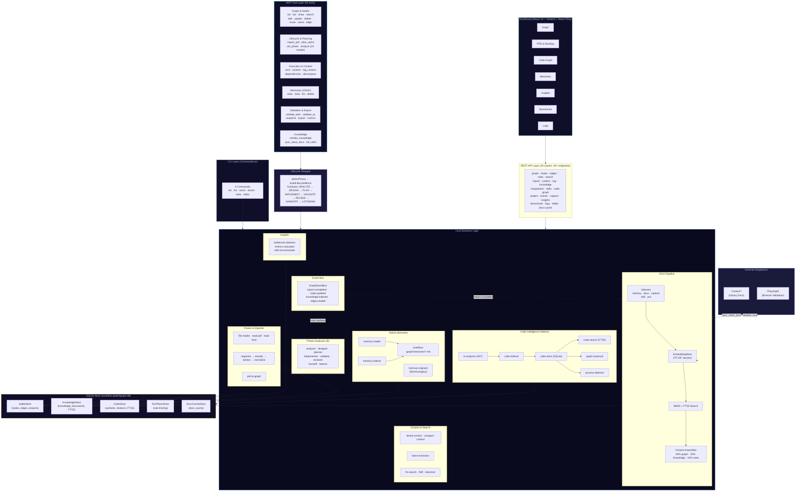

# Architecture Diagram — mcp-graph

> Diagrama Mermaid da arquitetura completa do mcp-graph. Cole em [mermaid.live](https://mermaid.live) para visualizar interativamente.

```mermaid
graph TB
  subgraph External["External Integrations"]
    CTX7["Context7<br/>(Library Docs)"]
    PW["Playwright<br/>(Browser Validation)"]
  end

  subgraph CLI["CLI Layer (Commander.js)"]
    CMD["6 Commands<br/>init · list · serve · doctor · stats · index"]
  end

  subgraph MCP["MCP Tool Layer (30 tools)"]
    direction LR
    GRAPH_TOOLS["Graph & Nodes<br/>init · list · show · search<br/>add · update · delete · move · clone · edge"]
    PLAN_TOOLS["Lifecycle & Planning<br/>import_prd · plan_sprint<br/>set_phase · analyze (24 modes)"]
    EXEC_TOOLS["Execution & Context<br/>next · context · rag_context<br/>dependencies · decompose"]
    MEM_TOOLS["Memories (CRUD)<br/>write · read · list · delete"]
    VAL_TOOLS["Validation & Export<br/>validate_task · validate_ac<br/>snapshot · export · metrics"]
    KNOW_TOOLS["Knowledge<br/>reindex_knowledge<br/>sync_stack_docs · list_skills"]
  end

  subgraph API["REST API Layer (20 routers, 44+ endpoints)"]
    API_ROUTES["graph · nodes · edges · stats · search<br/>import · context · rag · knowledge<br/>integrations · skills · code-graph<br/>project · events · capture · insights<br/>benchmark · logs · folder · docs-cache"]
  end

  subgraph LIFECYCLE["Lifecycle Wrapper"]
    LW["detectPhase → buildLifecycleBlock<br/>8 phases: ANALYZE → DESIGN → PLAN →<br/>IMPLEMENT → VALIDATE → REVIEW →<br/>HANDOFF → LISTENING"]
  end

  subgraph CORE["Core Business Logic"]
    direction TB

    subgraph PARSER["Parser & Importer"]
      P1["file-reader · read-pdf · read-html"]
      P2["segment → classify → extract → normalize"]
      P3["prd-to-graph"]
    end

    subgraph PHASES["Phase Analyzers (8)"]
      PH["analyzer · designer · planner<br/>implementer · validator · reviewer<br/>handoff · listener"]
    end

    subgraph CODE_INTEL["Code Intelligence (Native)"]
      CI1["ts-analyzer (AST)"]
      CI2["code-indexer"]
      CI3["code-store (SQLite)"]
      CI4["code-search (FTS5)"]
      CI5["graph-traversal"]
      CI6["process-detector"]
      CI1 --> CI2 --> CI3
      CI3 --> CI4
      CI3 --> CI5
      CI3 --> CI6
    end

    subgraph RAG["RAG Pipeline"]
      IDX["Indexers<br/>memory · docs · capture<br/>skill · prd"]
      EMB["EmbeddingStore<br/>(TF-IDF vectors)"]
      CTX_ASM["Context Assembler<br/>60% graph · 30% knowledge · 10% meta"]
      BM25["BM25 + FTS5 Search"]
      IDX --> EMB
      EMB --> BM25
      BM25 --> CTX_ASM
    end

    subgraph MEMORY["Native Memories"]
      MR["memory-reader"]
      MI["memory-indexer"]
      MM["memory-migrator<br/>(Serena legacy)"]
      FS["workflow-graph/memories/*.md"]
      MR --> FS
      MI --> FS
    end

    subgraph EVENTS["Event Bus"]
      EB["GraphEventBus<br/>import:completed · node:updated<br/>knowledge:indexed · edge:created"]
    end

    subgraph CONTEXT["Context & Search"]
      TC["tiered-context · compact-context"]
      TE["token-estimator"]
      SEARCH["fts-search · tfidf · tokenizer"]
    end

    subgraph INSIGHTS["Insights"]
      INS["bottleneck-detector<br/>metrics-calculator<br/>skill-recommender"]
    end
  end

  subgraph STORE["SQLite Store (workflow-graph/graph.db)"]
    direction LR
    SS["SqliteStore<br/>(nodes, edges, projects)"]
    KS["KnowledgeStore<br/>(knowledge_documents, FTS5)"]
    CS["CodeStore<br/>(symbols, relations, FTS5)"]
    TTS["ToolTokenStore<br/>(rate limiting)"]
    DCS["DocsCacheStore<br/>(docs_cache)"]
  end

  subgraph DASHBOARD["Dashboard (React 19 + Tailwind + React Flow)"]
    direction LR
    T1["Graph"]
    T2["PRD & Backlog"]
    T3["Code Graph"]
    T4["Memories"]
    T5["Insights"]
    T6["Benchmark"]
    T7["Logs"]
  end

  %% Connections
  CMD --> CORE
  MCP --> LIFECYCLE --> CORE
  API --> CORE
  DASHBOARD --> API

  CORE --> STORE
  CORE --> EVENTS

  CTX7 -.->|sync_stack_docs| RAG
  PW -.->|validate_task| RAG

  PARSER --> SS
  PARSER --> KS
  CODE_INTEL --> CS
  MEMORY --> KS
  RAG --> KS
  RAG --> EMB
  INSIGHTS --> SS

  EVENTS -.->|import:completed| RAG
  EVENTS -.->|node:updated| PHASES

  style External fill:#1a1a3a,stroke:#6366f1,color:#c0c0e0
  style CLI fill:#0f0f2a,stroke:#475569,color:#c0c0e0
  style MCP fill:#0f0f2a,stroke:#22d3ee,color:#c0c0e0
  style CORE fill:#0a0a1f,stroke:#3b82f6,color:#c0c0e0
  style STORE fill:#0f0f2a,stroke:#f59e0b,color:#c0c0e0
  style DASHBOARD fill:#0f0f2a,stroke:#10b981,color:#c0c0e0
  style LIFECYCLE fill:#1a1a3a,stroke:#a855f7,color:#c0c0e0
```
