# mcp-graph — Ciclo de Vida Completo do Desenvolvimento

> Como agents, skills, prompts e MCPs se orquestram para transformar uma ideia em código de produção seguindo a metodologia XP Anti-Vibe-Coding.

---

## Visão Geral

O mcp-graph é o **source of truth** do ciclo de desenvolvimento. Ele transforma PRDs em grafos de execução persistentes (SQLite), permitindo que agents trabalhem de forma estruturada, rastreável e eficiente em tokens.

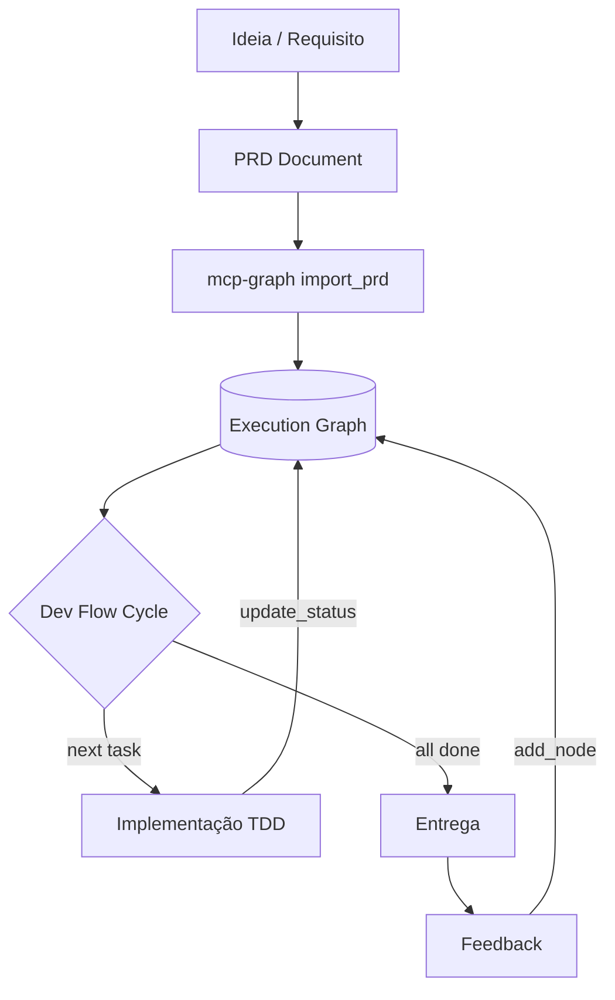
```mermaid
graph TD
    IDEA[Ideia / Requisito] --> PRD[PRD Document]
    PRD --> IMPORT[mcp-graph import_prd]
    IMPORT --> GRAPH[(Execution Graph)]
    GRAPH --> CYCLE{Dev Flow Cycle}
    CYCLE --> |next task| IMPLEMENT[Implementação TDD]
    IMPLEMENT --> |update_status| GRAPH
    CYCLE --> |all done| DELIVER[Entrega]
    DELIVER --> FEEDBACK[Feedback]
    FEEDBACK --> |add_node| GRAPH
```

---

## Arquitetura de Agents

Quatro MCPs trabalham em conjunto, cada um com responsabilidade clara:

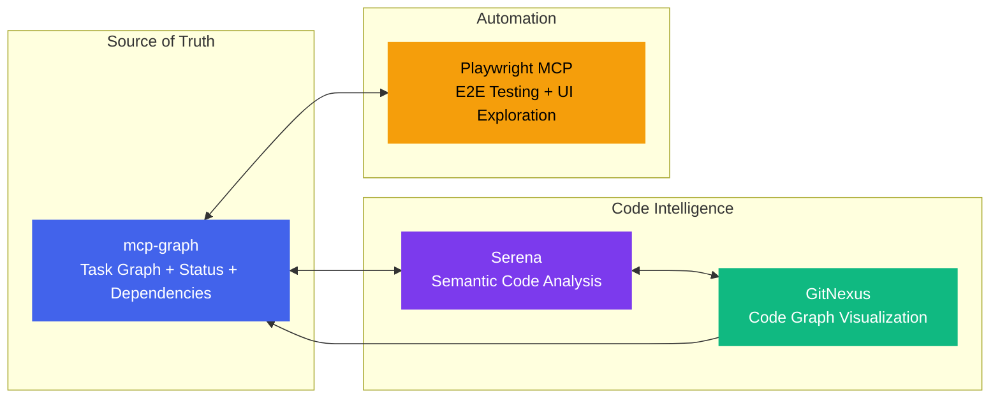
```mermaid
graph LR
    subgraph "Source of Truth"
        MCPGraph[mcp-graph<br/>Task Graph + Status + Dependencies]
    end

    subgraph "Code Intelligence"
        Serena[Serena<br/>Semantic Code Analysis]
        GitNexus[GitNexus<br/>Code Graph Visualization]
    end

    subgraph "Automation"
        Playwright[Playwright MCP<br/>E2E Testing + UI Exploration]
    end

    MCPGraph <--> Serena
    MCPGraph <--> Playwright
    Serena <--> GitNexus
    GitNexus --> MCPGraph

    style MCPGraph fill:#4263eb,color:#fff,stroke:#4263eb
    style Serena fill:#7c3aed,color:#fff,stroke:#7c3aed
    style GitNexus fill:#10b981,color:#fff,stroke:#10b981
    style Playwright fill:#f59e0b,color:#000,stroke:#f59e0b
```

| MCP | Papel | Quando |
|-----|-------|--------|
| **mcp-graph** | Grafo de tarefas, dependências, status, progresso | Todas as fases — sempre ativo |
| **Serena** | Análise semântica de código: símbolos, padrões, refactor | Antes de implementar, durante review |
| **GitNexus** | Visualização do code graph, entendimento da codebase | Pós-PRD, quando já existe código |
| **Playwright** | Automação de browser: E2E, exploração de UI | Fase VALIDATE |

---

## O Ciclo Dev Flow (8 Fases)

O `dev-flow-orchestrator` conduz o ciclo completo. Cada fase tem skills específicos, uso de agents e protocolo com o mcp-graph.

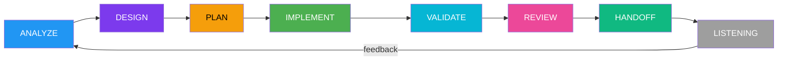
```mermaid
graph LR
    A[ANALYZE] --> D[DESIGN]
    D --> P[PLAN]
    P --> I[IMPLEMENT]
    I --> V[VALIDATE]
    V --> R[REVIEW]
    R --> H[HANDOFF]
    H --> L[LISTENING]
    L --> |feedback| A

    style A fill:#2196f3,color:#fff
    style D fill:#7c3aed,color:#fff
    style P fill:#f59e0b,color:#000
    style I fill:#4caf50,color:#fff
    style V fill:#06b6d4,color:#fff
    style R fill:#ec4899,color:#fff
    style H fill:#10b981,color:#fff
    style L fill:#9e9e9e,color:#fff
```

---

### Fase 1: ANALYZE — Descobrir o que construir

**Objetivo:** Transformar uma ideia vaga em um PRD estruturado com user stories e acceptance criteria.

**Skills:**
- `/create-prd-chat-mode` — Modo interativo: faz perguntas, refina requisitos, gera PRD completo
- `/business-analyst` — Análise de requisitos, mapeamento de processos
- `/se-product-manager` — Feasibility técnica, roadmapping

**Protocolo mcp-graph:** Nenhum (PRD ainda não existe no grafo)

**Saída:** PRD com user stories no formato Given-When-Then

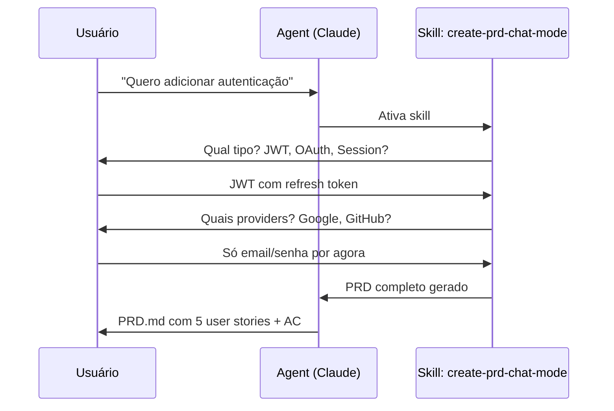
```mermaid
sequenceDiagram
    participant U as Usuário
    participant A as Agent (Claude)
    participant S as Skill: create-prd-chat-mode

    U->>A: "Quero adicionar autenticação"
    A->>S: Ativa skill
    S->>U: Qual tipo? JWT, OAuth, Session?
    U->>S: JWT com refresh token
    S->>U: Quais providers? Google, GitHub?
    U->>S: Só email/senha por agora
    S->>A: PRD completo gerado
    A->>U: PRD.md com 5 user stories + AC
```

---

### Fase 2: DESIGN — Definir arquitetura

**Objetivo:** Definir a arquitetura técnica antes de qualquer código.

**Skills:**
- `/breakdown-epic-arch` — Spec técnica de alto nível
- `/context-architect` — Padrões de contexto, eficiência de tokens
- `/backend-architect` — Design patterns, boundaries de serviço

**Agents:**
- **Serena** — Analisa código existente para entender padrões atuais

**Saída:** Architecture spec + ADR (Architecture Decision Records)

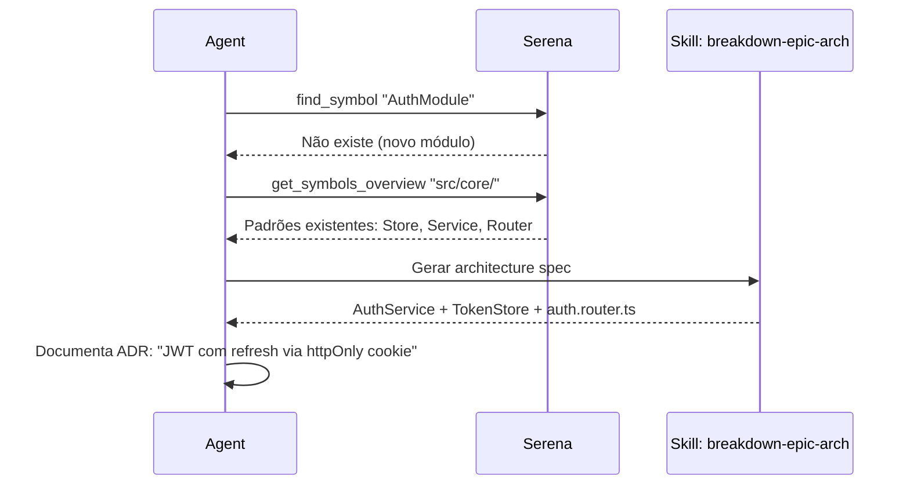
```mermaid
sequenceDiagram
    participant A as Agent
    participant Serena as Serena
    participant Skill as Skill: breakdown-epic-arch

    A->>Serena: find_symbol "AuthModule"
    Serena-->>A: Não existe (novo módulo)
    A->>Serena: get_symbols_overview "src/core/"
    Serena-->>A: Padrões existentes: Store, Service, Router
    A->>Skill: Gerar architecture spec
    Skill-->>A: AuthService + TokenStore + auth.router.ts
    A->>A: Documenta ADR: "JWT com refresh via httpOnly cookie"
```

---

### Fase 3: PLAN — Decompor em tarefas atômicas

**Objetivo:** Transformar o PRD em tarefas rastreáveis no grafo de execução.

**Skills:**
- `/breakdown-feature-prd` — Decompõe feature em tasks atômicas (< 1 dia cada)
- `/track-with-mcp-graph` — Sincroniza plano com o grafo

**Protocolo mcp-graph:**
1. `import_prd` — Auto-parse: segmenta → classifica → extrai entidades → infere dependências → cria nós + edges
2. `stats` — Verificar estado: "8 tasks planned, 0% complete"

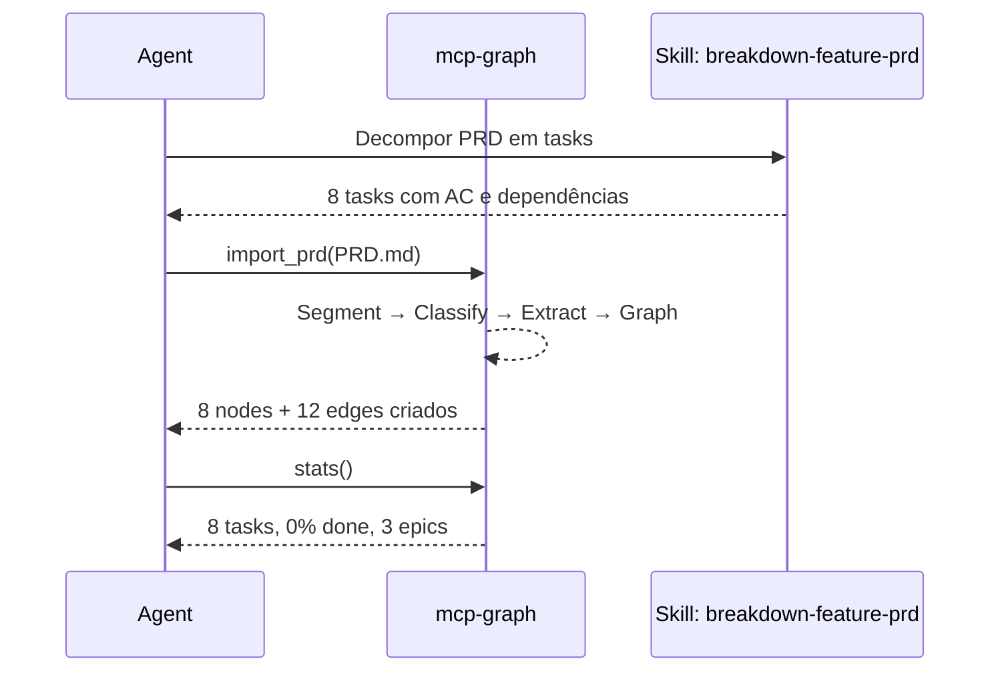
```mermaid
sequenceDiagram
    participant A as Agent
    participant MCP as mcp-graph
    participant Skill as Skill: breakdown-feature-prd

    A->>Skill: Decompor PRD em tasks
    Skill-->>A: 8 tasks com AC e dependências
    A->>MCP: import_prd(PRD.md)
    MCP-->>MCP: Segment → Classify → Extract → Graph
    MCP-->>A: 8 nodes + 12 edges criados
    A->>MCP: stats()
    MCP-->>A: 8 tasks, 0% done, 3 epics
```

**O que o import_prd faz automaticamente:**

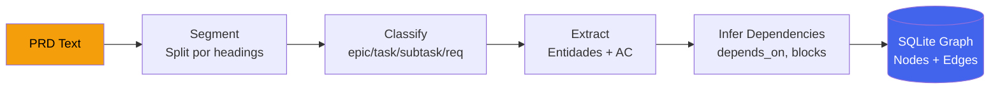
```mermaid
graph LR
    PRD[PRD Text] --> SEG[Segment<br/>Split por headings]
    SEG --> CLS[Classify<br/>epic/task/subtask/req]
    CLS --> EXT[Extract<br/>Entidades + AC]
    EXT --> DEP[Infer Dependencies<br/>depends_on, blocks]
    DEP --> GRAPH[(SQLite Graph<br/>Nodes + Edges)]

    style PRD fill:#f59e0b,color:#000
    style GRAPH fill:#4263eb,color:#fff
```

---

### Fase 4: IMPLEMENT — Executar com TDD

**Objetivo:** Implementar cada task seguindo Red → Green → Refactor.

**Skills:**
- `/subagent-driven-development` — Subagente fresh por task, review em dois estágios

**Agents:**
- **Serena** — Analisar módulo alvo antes de implementar
- **mcp-graph** — Rastrear status (in_progress → completed)

**Protocolo:**

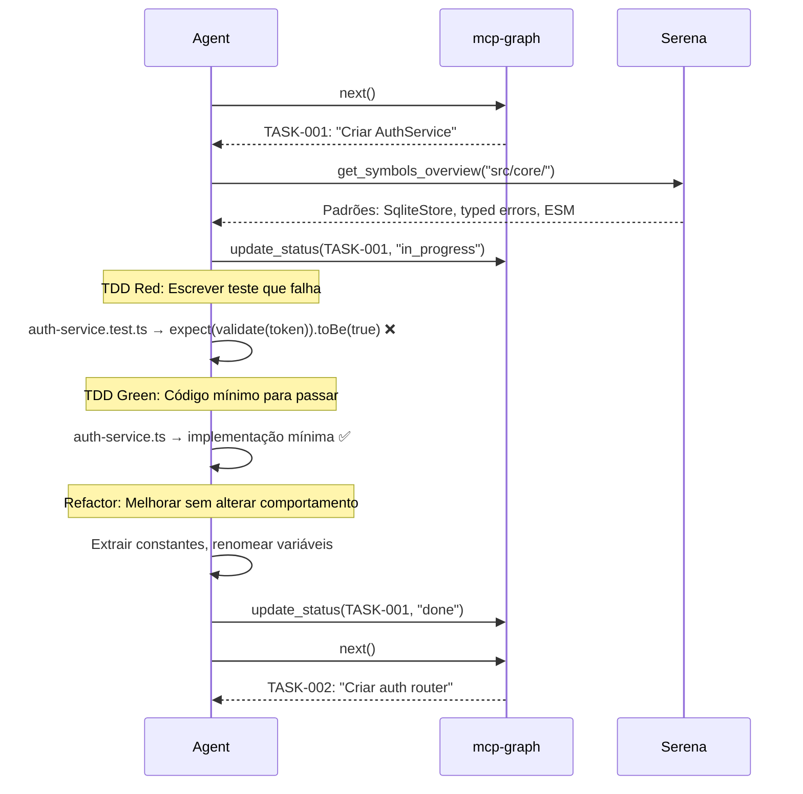
```mermaid
sequenceDiagram
    participant A as Agent
    participant MCP as mcp-graph
    participant Serena as Serena

    A->>MCP: next()
    MCP-->>A: TASK-001: "Criar AuthService"
    A->>Serena: get_symbols_overview("src/core/")
    Serena-->>A: Padrões: SqliteStore, typed errors, ESM
    A->>MCP: update_status(TASK-001, "in_progress")

    Note over A: TDD Red: Escrever teste que falha
    A->>A: auth-service.test.ts → expect(validate(token)).toBe(true) ❌

    Note over A: TDD Green: Código mínimo para passar
    A->>A: auth-service.ts → implementação mínima ✅

    Note over A: Refactor: Melhorar sem alterar comportamento
    A->>A: Extrair constantes, renomear variáveis

    A->>MCP: update_status(TASK-001, "done")
    A->>MCP: next()
    MCP-->>A: TASK-002: "Criar auth router"
```

**Princípio Anti-Vibe-Coding:** Se o AI sugere feature sem teste → RECUSAR. Sempre Red primeiro.

---

### Fase 5: VALIDATE — Testes E2E

**Objetivo:** Validar que tudo funciona end-to-end com browser real.

**Skills (em sequência):**
1. `/playwright-explore-website` — Mapear UI, extrair seletores reais
2. `/playwright-generate-test` — Gerar `.spec.ts` a partir de cenários
3. `/playwright-tester-mode` — Rodar, diagnosticar, iterar até passar
4. `/e2e-testing` — Cobertura completa: visual regression, cross-browser

**Agents:**
- **Playwright MCP** — Automação de browser

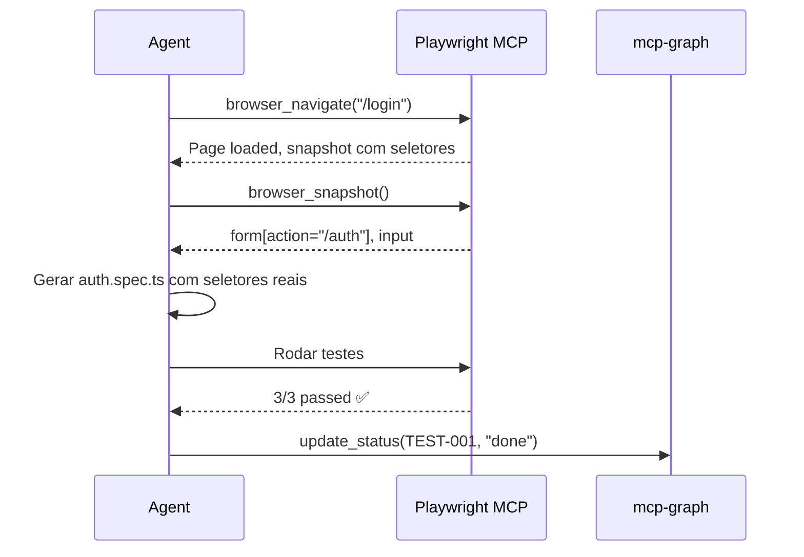
```mermaid
sequenceDiagram
    participant A as Agent
    participant PW as Playwright MCP
    participant MCP as mcp-graph

    A->>PW: browser_navigate("/login")
    PW-->>A: Page loaded, snapshot com seletores
    A->>PW: browser_snapshot()
    PW-->>A: form[action="/auth"], input#email, input#password, button#submit
    A->>A: Gerar auth.spec.ts com seletores reais
    A->>PW: Rodar testes
    PW-->>A: 3/3 passed ✅
    A->>MCP: update_status(TEST-001, "done")
```

---

### Fase 6: REVIEW — Qualidade e observabilidade

**Objetivo:** Garantir qualidade de código, segurança, e observabilidade.

**Skills:**
- `/code-reviewer` — Review profundo: qualidade + segurança
- `/code-review-checklist` — Checklist padronizado
- `/review-and-refactor` — Tech debt → refatorar agora, não depois
- `/log-standardization-framework` — Logs estruturados
- `/observability-engineer` — Métricas, health, SLOs

**Agents:**
- **Serena** — Análise de padrões, inconsistências

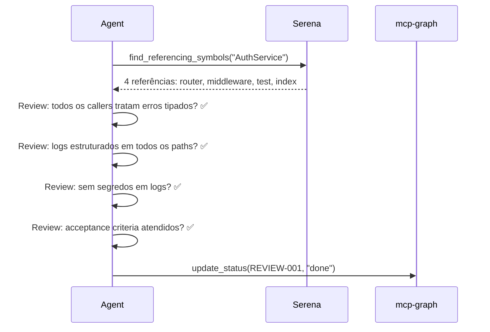
```mermaid
sequenceDiagram
    participant A as Agent
    participant Serena as Serena
    participant MCP as mcp-graph

    A->>Serena: find_referencing_symbols("AuthService")
    Serena-->>A: 4 referências: router, middleware, test, index
    A->>A: Review: todos os callers tratam erros tipados? ✅
    A->>A: Review: logs estruturados em todos os paths? ✅
    A->>A: Review: sem segredos em logs? ✅
    A->>A: Review: acceptance criteria atendidos? ✅
    A->>MCP: update_status(REVIEW-001, "done")
```

---

### Fase 7: HANDOFF — Entregar

**Objetivo:** Criar PR, atualizar docs, preparar demo.

**Protocolo mcp-graph:**
1. `update_status` do nó raiz (PRD) → `done`
2. `export_graph` → salvar snapshot em `docs/`

**Saída:** PR criado, documentação atualizada, grafo exportado.

---

### Fase 8: LISTENING — Feedback loop

**Objetivo:** Demo para stakeholders, coletar feedback, alimentar próxima iteração.

**Protocolo mcp-graph:**
- Cada feedback → `add_node` com tipo `task` ou `requirement`
- Volta para ANALYZE com contexto acumulado

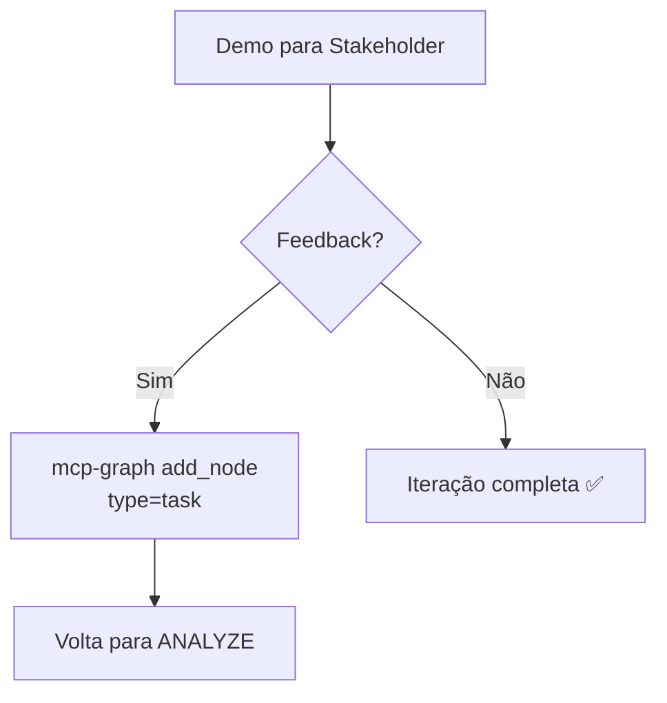
```mermaid
graph TD
    DEMO[Demo para Stakeholder] --> FB{Feedback?}
    FB --> |Sim| ADD[mcp-graph add_node<br/>type=task]
    ADD --> ANALYZE[Volta para ANALYZE]
    FB --> |Não| DONE[Iteração completa ✅]
```

---

## Mapa de Skills por Fase

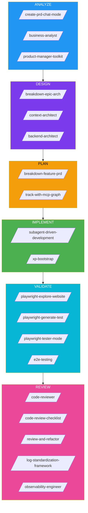
```mermaid
graph TB
    subgraph "ANALYZE"
        S1[/create-prd-chat-mode/]
        S2[/business-analyst/]
        S3[/product-manager-toolkit/]
    end

    subgraph "DESIGN"
        S4[/breakdown-epic-arch/]
        S5[/context-architect/]
        S6[/backend-architect/]
    end

    subgraph "PLAN"
        S7[/breakdown-feature-prd/]
        S8[/track-with-mcp-graph/]
    end

    subgraph "IMPLEMENT"
        S9[/subagent-driven-development/]
        S10[/xp-bootstrap/]
    end

    subgraph "VALIDATE"
        S11[/playwright-explore-website/]
        S12[/playwright-generate-test/]
        S13[/playwright-tester-mode/]
        S14[/e2e-testing/]
    end

    subgraph "REVIEW"
        S15[/code-reviewer/]
        S16[/code-review-checklist/]
        S17[/review-and-refactor/]
        S18[/log-standardization-framework/]
        S19[/observability-engineer/]
    end

    ANALYZE --> DESIGN --> PLAN --> IMPLEMENT --> VALIDATE --> REVIEW

    style ANALYZE fill:#2196f3,color:#fff
    style DESIGN fill:#7c3aed,color:#fff
    style PLAN fill:#f59e0b,color:#000
    style IMPLEMENT fill:#4caf50,color:#fff
    style VALIDATE fill:#06b6d4,color:#fff
    style REVIEW fill:#ec4899,color:#fff
```

---

## Modelo de Dados do Grafo

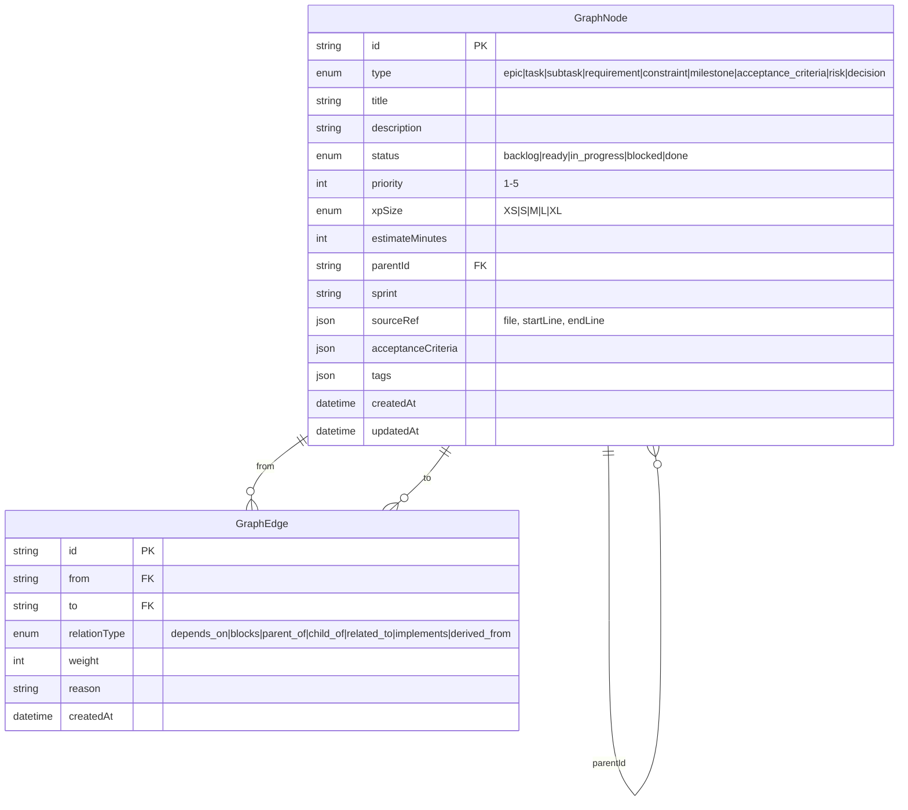
```mermaid
erDiagram
    GraphNode {
        string id PK
        enum type "epic|task|subtask|requirement|constraint|milestone|acceptance_criteria|risk|decision"
        string title
        string description
        enum status "backlog|ready|in_progress|blocked|done"
        int priority "1-5"
        enum xpSize "XS|S|M|L|XL"
        int estimateMinutes
        string parentId FK
        string sprint
        json sourceRef "file, startLine, endLine"
        json acceptanceCriteria
        json tags
        datetime createdAt
        datetime updatedAt
    }

    GraphEdge {
        string id PK
        string from FK
        string to FK
        enum relationType "depends_on|blocks|parent_of|child_of|related_to|implements|derived_from"
        int weight
        string reason
        datetime createdAt
    }

    GraphNode ||--o{ GraphEdge : "from"
    GraphNode ||--o{ GraphEdge : "to"
    GraphNode ||--o{ GraphNode : "parentId"
```

---

## Hierarquia de Tarefas

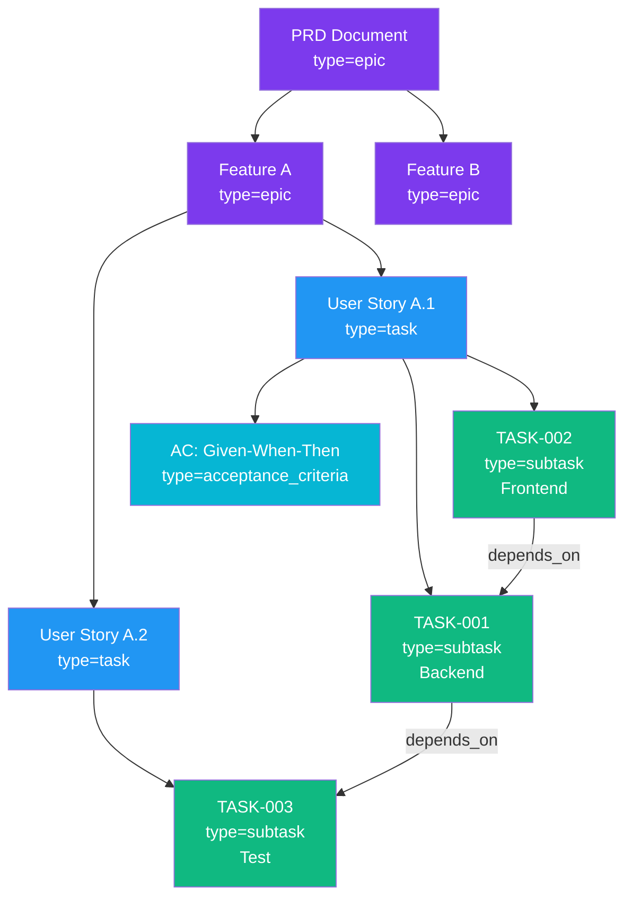
```mermaid
graph TD
    PRD[PRD Document<br/>type=epic] --> F1[Feature A<br/>type=epic]
    PRD --> F2[Feature B<br/>type=epic]

    F1 --> US1[User Story A.1<br/>type=task]
    F1 --> US2[User Story A.2<br/>type=task]

    US1 --> T1[TASK-001<br/>type=subtask<br/>Backend]
    US1 --> T2[TASK-002<br/>type=subtask<br/>Frontend]
    US2 --> T3[TASK-003<br/>type=subtask<br/>Test]

    T1 --> |depends_on| T3
    T2 --> |depends_on| T1

    AC1[AC: Given-When-Then<br/>type=acceptance_criteria]
    US1 --> AC1

    style PRD fill:#7c3aed,color:#fff
    style F1 fill:#7c3aed,color:#fff
    style F2 fill:#7c3aed,color:#fff
    style US1 fill:#2196f3,color:#fff
    style US2 fill:#2196f3,color:#fff
    style T1 fill:#10b981,color:#fff
    style T2 fill:#10b981,color:#fff
    style T3 fill:#10b981,color:#fff
    style AC1 fill:#06b6d4,color:#fff
```

---

## Comandos mcp-graph por Fase

| Fase | Comando | Propósito |
|------|---------|-----------|
| **Início** | `list`, `stats` | Verificar estado atual |
| **PLAN** | `import_prd` | Parse PRD → nodes + edges |
| **PLAN** | `add_node`, `add_edge` | Criar tarefas manualmente |
| **IMPLEMENT** | `next` | Próxima task não bloqueada (respeita deps) |
| **IMPLEMENT** | `update_status → in_progress` | Marcar início |
| **IMPLEMENT** | `update_status → done` | Marcar conclusão |
| **VALIDATE** | `update_status [test-id] → done` | Marcar teste validado |
| **REVIEW** | `export_graph` | Exportar para visualização |
| **HANDOFF** | `bulk_update_status → done` | Fechar PRD |
| **LISTENING** | `add_node` | Registrar feedback |

---

## Princípios XP Anti-Vibe-Coding

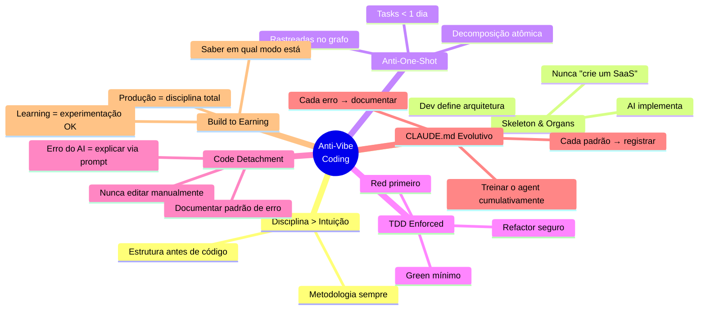
```mermaid
mindmap
  root((Anti-Vibe<br/>Coding))
    Disciplina > Intuição
      Estrutura antes de código
      Metodologia sempre
    Skeleton & Organs
      Dev define arquitetura
      AI implementa
      Nunca "crie um SaaS"
    Anti-One-Shot
      Decomposição atômica
      Tasks < 1 dia
      Rastreadas no grafo
    TDD Enforced
      Red primeiro
      Green mínimo
      Refactor seguro
    Code Detachment
      Erro do AI = explicar via prompt
      Nunca editar manualmente
      Documentar padrão de erro
    CLAUDE.md Evolutivo
      Cada erro → documentar
      Cada padrão → registrar
      Treinar o agent cumulativamente
    Build to Earning
      Produção = disciplina total
      Learning = experimentação OK
      Saber em qual modo está
```

---

## Fluxo Completo — Exemplo Prático

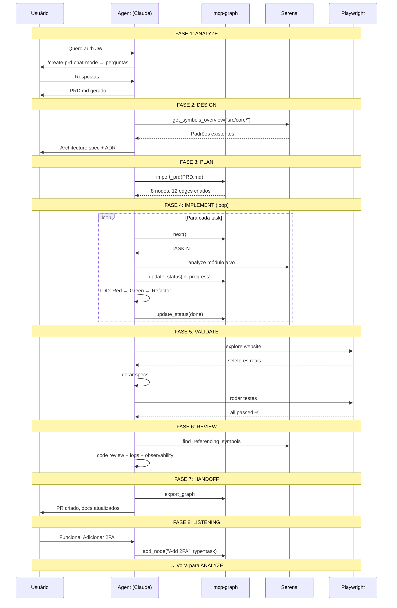
```mermaid
sequenceDiagram
    participant U as Usuário
    participant A as Agent (Claude)
    participant MCP as mcp-graph
    participant S as Serena
    participant PW as Playwright

    Note over U,PW: FASE 1: ANALYZE
    U->>A: "Quero auth JWT"
    A->>U: /create-prd-chat-mode → perguntas
    U->>A: Respostas
    A->>U: PRD.md gerado

    Note over U,PW: FASE 2: DESIGN
    A->>S: get_symbols_overview("src/core/")
    S-->>A: Padrões existentes
    A->>U: Architecture spec + ADR

    Note over U,PW: FASE 3: PLAN
    A->>MCP: import_prd(PRD.md)
    MCP-->>A: 8 nodes, 12 edges criados

    Note over U,PW: FASE 4: IMPLEMENT (loop)
    loop Para cada task
        A->>MCP: next()
        MCP-->>A: TASK-N
        A->>S: analyze módulo alvo
        A->>MCP: update_status(in_progress)
        A->>A: TDD: Red → Green → Refactor
        A->>MCP: update_status(done)
    end

    Note over U,PW: FASE 5: VALIDATE
    A->>PW: explore website
    PW-->>A: seletores reais
    A->>A: gerar specs
    A->>PW: rodar testes
    PW-->>A: all passed ✅

    Note over U,PW: FASE 6: REVIEW
    A->>S: find_referencing_symbols
    A->>A: code review + logs + observability

    Note over U,PW: FASE 7: HANDOFF
    A->>MCP: export_graph
    A->>U: PR criado, docs atualizados

    Note over U,PW: FASE 8: LISTENING
    U->>A: "Funciona! Adicionar 2FA"
    A->>MCP: add_node("Add 2FA", type=task)
    Note over U,PW: → Volta para ANALYZE
```

---

## Ecossistema de Skills

### Organização por Disciplina

| Disciplina | Skills | Fases |
|------------|--------|-------|
| **Agents** (21) | dev-flow-orchestrator, xp-bootstrap, subagent-driven-development, track-with-mcp-graph, create-prd-chat-mode, breakdown-epic-arch, breakdown-feature-prd, project-scaffold, ... | Todas |
| **Code Review** (8) | code-reviewer, code-review-checklist, review-and-refactor, code-review-excellence, ... | REVIEW |
| **Testing** (22+) | playwright-explore-website, playwright-generate-test, playwright-tester-mode, e2e-testing, breakdown-test, ... | VALIDATE |
| **Observability** (12+) | log-standardization-framework, log-architecture-enforcement, observability-engineer, distributed-tracing, ... | REVIEW |
| **Security** (14) | OWASP scanning, pentesting, vulnerability analysis, ... | REVIEW |
| **Software Quality** (16+) | C4 architecture, ADR generator, design patterns, ... | DESIGN |

### Como Skills São Carregados

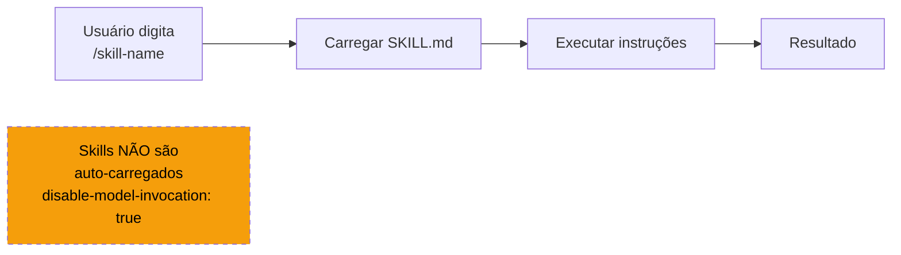
```mermaid
graph LR
    USER[Usuário digita<br/>/skill-name] --> LOAD[Carregar SKILL.md]
    LOAD --> EXEC[Executar instruções]
    EXEC --> RESULT[Resultado]

    NOTE[Skills NÃO são<br/>auto-carregados<br/>disable-model-invocation: true]

    style NOTE fill:#f59e0b,color:#000,stroke-dasharray: 5 5
```

**Anatomia de um Skill:**

```
skills/
  agents/
    dev-flow-orchestrator/
      SKILL.md          ← Instruções completas
  code-review/
    code-reviewer/
      SKILL.md
  testing/
    e2e-testing/
      SKILL.md
  ...
```

Cada `SKILL.md` contém:
- **Frontmatter:** nome, descrição, categoria, risco
- **Use this skill when:** Quando usar
- **Do not use when:** Quando NÃO usar
- **Instructions:** Passos detalhados com exemplos

---

## Verificação (Definition of Done)

Antes de marcar qualquer task como `done`:

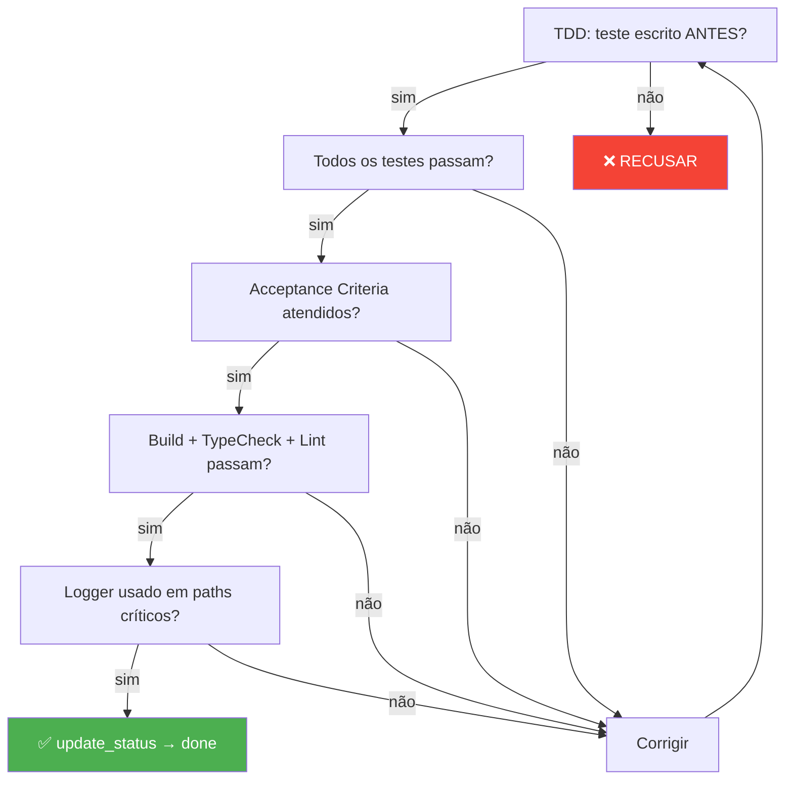
```mermaid
graph TD
    TDD[TDD: teste escrito ANTES?] --> |sim| TESTS[Todos os testes passam?]
    TDD --> |não| FAIL[❌ RECUSAR]
    TESTS --> |sim| AC[Acceptance Criteria atendidos?]
    TESTS --> |não| FIX[Corrigir]
    AC --> |sim| BUILD[Build + TypeCheck + Lint passam?]
    AC --> |não| FIX
    BUILD --> |sim| LOGS[Logger usado em paths críticos?]
    BUILD --> |não| FIX
    LOGS --> |sim| DONE[✅ update_status → done]
    LOGS --> |não| FIX
    FIX --> TDD

    style DONE fill:#4caf50,color:#fff
    style FAIL fill:#f44336,color:#fff
```

---

## Resumo

O mcp-graph não é apenas um task tracker. É o **motor de execução** que:

1. **Parseia PRDs** automaticamente em grafos de dependência
2. **Orquestra agents** (Serena, Playwright, GitNexus) por fase
3. **Garante disciplina** via TDD, code review, e definition of done
4. **Preserva contexto** entre sessões (SQLite persistente)
5. **Economiza tokens** ao dar ao agent exatamente a próxima tarefa com contexto mínimo
6. **Visualiza progresso** em dashboard interativo (React Flow)

> **Princípio fundamental:** O desenvolvedor define o QUE e o COMO (arquitetura). O AI executa com disciplina. Nunca o contrário.
