# mcp-graph — Ciclo de Vida Completo do Desenvolvimento

> Como agents, skills, prompts e MCPs se orquestram para transformar uma ideia em código de produção seguindo a metodologia XP Anti-Vibe-Coding.

---

## Visão Geral

O mcp-graph é o **source of truth** do ciclo de desenvolvimento. Ele transforma PRDs em grafos de execução persistentes (SQLite), permitindo que agents trabalhem de forma estruturada, rastreável e eficiente em tokens. Para um resumo prático das 8 fases com gate checks e analyze modes, veja o [Advanced Guide §1](../guides/ADVANCED-GUIDE.md).

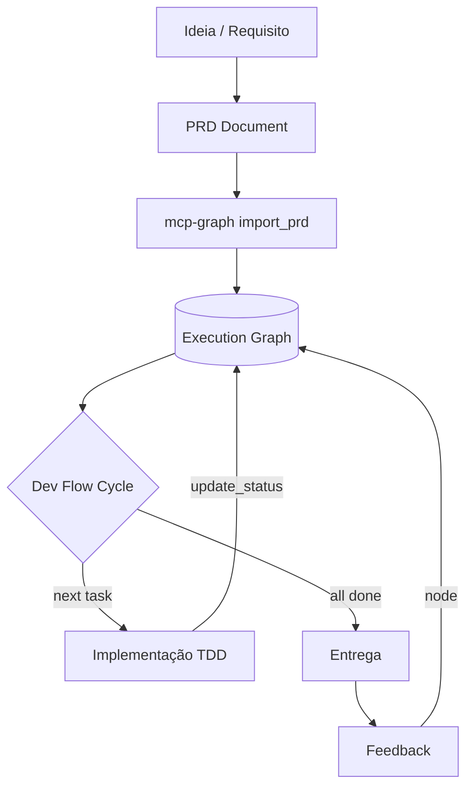
```mermaid
graph TD
    IDEA[Ideia / Requisito] --> PRD[PRD Document]
    PRD --> IMPORT[mcp-graph import_prd]
    IMPORT --> GRAPH[(Execution Graph)]
    GRAPH --> CYCLE{Dev Flow Cycle}
    CYCLE --> |next task| IMPLEMENT[Implementação TDD]
    IMPLEMENT --> |update_status| GRAPH
    CYCLE --> |all done| DELIVER[Entrega]
    DELIVER --> FEEDBACK[Feedback]
    FEEDBACK --> |node| GRAPH
```

---

## Arquitetura de Agents

Três MCPs + dois sistemas nativos trabalham em conjunto, coordenados pelo `IntegrationOrchestrator` via `GraphEventBus`:

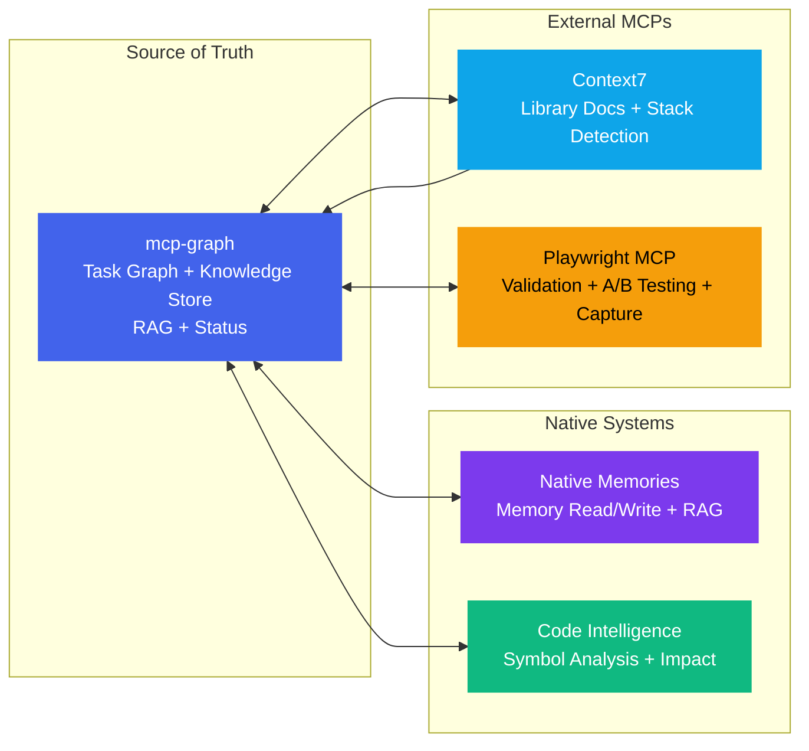
```mermaid
graph LR
    subgraph "Source of Truth"
        MCPGraph[mcp-graph<br/>Task Graph + Knowledge Store<br/>RAG + Status]
    end

    subgraph "Native Systems"
        Memories[Native Memories<br/>Memory Read/Write + RAG]
        CodeIntel[Code Intelligence<br/>Symbol Analysis + Impact]
    end

    subgraph "External MCPs"
        Context7[Context7<br/>Library Docs + Stack Detection]
        Playwright[Playwright MCP<br/>Validation + A/B Testing + Capture]
    end

    MCPGraph <--> Memories
    MCPGraph <--> CodeIntel
    MCPGraph <--> Playwright
    MCPGraph <--> Context7
    Context7 --> MCPGraph

    style MCPGraph fill:#4263eb,color:#fff,stroke:#4263eb
    style Memories fill:#7c3aed,color:#fff,stroke:#7c3aed
    style CodeIntel fill:#10b981,color:#fff,stroke:#10b981
    style Context7 fill:#0ea5e9,color:#fff,stroke:#0ea5e9
    style Playwright fill:#f59e0b,color:#000,stroke:#f59e0b
```

| Sistema | Tipo | Papel | Quando |
|---------|------|-------|--------|
| **mcp-graph** | MCP | Grafo de tarefas, knowledge store, RAG, dependências, status | Todas as fases — sempre ativo |
| **Native Memories** | Nativo | Leitura/escrita de memórias, RAG query | Antes de implementar, durante review |
| **Code Intelligence** | Nativo | Symbol analysis, impact analysis, enriched context | DESIGN (impact analysis), IMPLEMENT (enriched context), REVIEW (blast radius) |
| **Context7** | MCP | Docs de libs, stack detection, sync automático de documentação | PLAN, IMPLEMENT |
| **Playwright** | MCP | Validação browser, A/B testing, content capture + indexação | Fase VALIDATE |

---

## Knowledge Pipeline

O mcp-graph integra um pipeline de conhecimento local que transforma múltiplas fontes em contexto otimizado para LLMs:

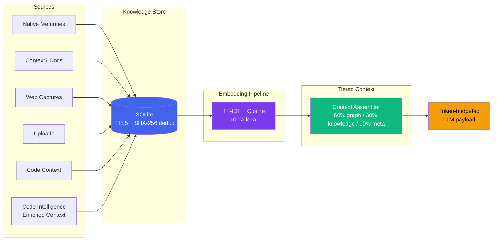
```mermaid
graph LR
    subgraph "Sources"
        S1[Native Memories]
        S2[Context7 Docs]
        S3[Web Captures]
        S4[Uploads]
        S5[Code Context]
        S6[Code Intelligence<br/>Enriched Context]
    end

    subgraph "Knowledge Store"
        KS[(SQLite<br/>FTS5 + SHA-256 dedup)]
    end

    subgraph "Embedding Pipeline"
        EMB[TF-IDF + Cosine<br/>100% local]
    end

    subgraph "Tiered Context"
        TC[Context Assembler<br/>60% graph / 30% knowledge / 10% meta]
    end

    S1 --> KS
    S2 --> KS
    S3 --> KS
    S4 --> KS
    S5 --> KS
    S6 --> KS
    KS --> EMB
    EMB --> TC
    TC --> LLM[Token-budgeted<br/>LLM payload]

    style KS fill:#4263eb,color:#fff
    style EMB fill:#7c3aed,color:#fff
    style TC fill:#10b981,color:#fff
    style LLM fill:#f59e0b,color:#000
```

**Componentes principais:**

- **Knowledge Store** — SQLite com FTS5, deduplicação SHA-256, 5 source types, chunking automático (~500 tokens)
- **Embedding Pipeline** — TF-IDF local com cosine similarity (sem APIs externas)
- **Tiered Context** — 3 níveis de compressão (Summary ~20 tokens, Standard ~150, Deep ~500+)
- **BM25 Compressor** — Filtra e rankeia chunks por relevância à query atual
- **Context Assembler** — Budget de tokens: 60% grafo, 30% knowledge, 10% metadata (redução de 70-85%)
- **Enriched Context** — `buildEnrichedContext()` funde native memories + Code Intelligence em contexto unificado por símbolo (on-demand, não event-driven)

**Orquestração event-driven** (`IntegrationOrchestrator` via `GraphEventBus`):

```
import:completed  → Trigger reindex (Memories + Docs)
knowledge:indexed → Rebuild embeddings
docs:synced       → Index into Knowledge Store
capture:completed → Index captured content
```

> Detalhes completos em [Knowledge Pipeline](../architecture/KNOWLEDGE-PIPELINE.md) e [Integrations Guide](./INTEGRATIONS-GUIDE.md).

---

## O Ciclo Dev Flow (8 Fases)

O `dev-flow-orchestrator` conduz o ciclo completo. Cada fase tem skills específicos, uso de agents e protocolo com o mcp-graph.

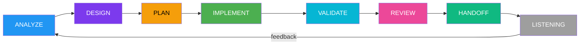
```mermaid
graph LR
    A[ANALYZE] --> D[DESIGN]
    D --> P[PLAN]
    P --> I[IMPLEMENT]
    I --> V[VALIDATE]
    V --> R[REVIEW]
    R --> H[HANDOFF]
    H --> L[LISTENING]
    L --> |feedback| A

    style A fill:#2196f3,color:#fff
    style D fill:#7c3aed,color:#fff
    style P fill:#f59e0b,color:#000
    style I fill:#4caf50,color:#fff
    style V fill:#06b6d4,color:#fff
    style R fill:#ec4899,color:#fff
    style H fill:#10b981,color:#fff
    style L fill:#9e9e9e,color:#fff
```

---

### Fase 1: ANALYZE — Descobrir o que construir

**Objetivo:** Transformar uma ideia vaga em um PRD estruturado com user stories e acceptance criteria.

**Skills:**
- `/create-prd-chat-mode` — Modo interativo: faz perguntas, refina requisitos, gera PRD completo
- `/business-analyst` — Análise de requisitos, mapeamento de processos
- `/se-product-manager` — Feasibility técnica, roadmapping

**Protocolo mcp-graph:** Nenhum (PRD ainda não existe no grafo)

**Saída:** PRD com user stories no formato Given-When-Then

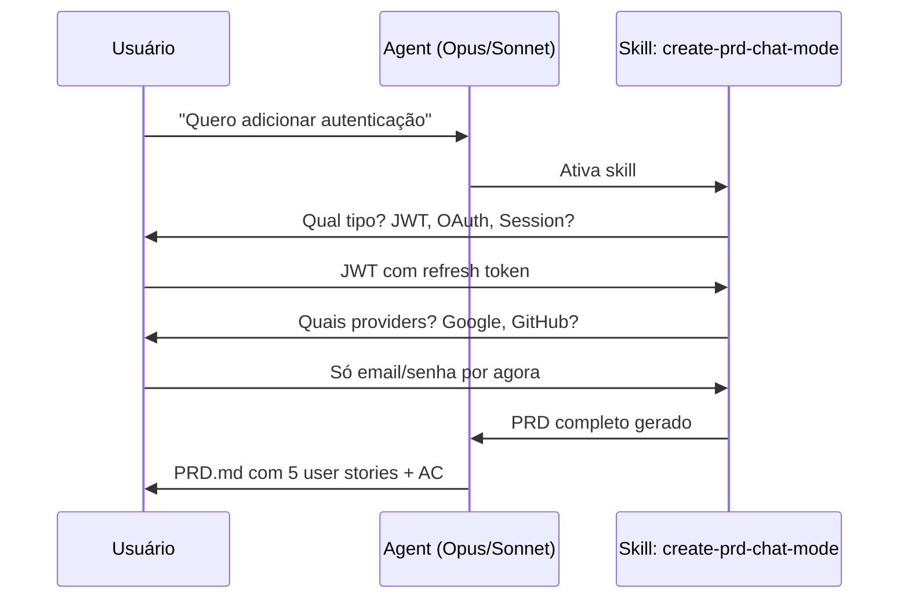
```mermaid
sequenceDiagram
    participant U as Usuário
    participant A as Agent (Opus/Sonnet)
    participant S as Skill: create-prd-chat-mode

    U->>A: "Quero adicionar autenticação"
    A->>S: Ativa skill
    S->>U: Qual tipo? JWT, OAuth, Session?
    U->>S: JWT com refresh token
    S->>U: Quais providers? Google, GitHub?
    U->>S: Só email/senha por agora
    S->>A: PRD completo gerado
    A->>U: PRD.md com 5 user stories + AC
```

---

### Fase 2: DESIGN — Definir arquitetura

**Objetivo:** Definir a arquitetura técnica antes de qualquer código.

**Skills:**
- `/breakdown-epic-arch` — Spec técnica de alto nível
- `/context-architect` — Padrões de contexto, eficiência de tokens
- `/backend-architect` — Design patterns, boundaries de serviço

**Sistemas nativos:**
- **Code Intelligence** — Analisa código existente para entender padrões atuais e avaliar blast radius de mudanças arquiteturais

**Saída:** Architecture spec + ADR (Architecture Decision Records)

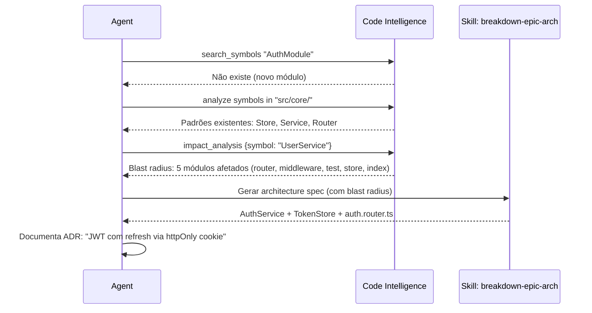
```mermaid
sequenceDiagram
    participant A as Agent
    participant CI as Code Intelligence
    participant Skill as Skill: breakdown-epic-arch

    A->>CI: search_symbols "AuthModule"
    CI-->>A: Não existe (novo módulo)
    A->>CI: analyze symbols in "src/core/"
    CI-->>A: Padrões existentes: Store, Service, Router
    A->>CI: impact_analysis {symbol: "UserService"}
    CI-->>A: Blast radius: 5 módulos afetados (router, middleware, test, store, index)
    A->>Skill: Gerar architecture spec (com blast radius)
    Skill-->>A: AuthService + TokenStore + auth.router.ts
    A->>A: Documenta ADR: "JWT com refresh via httpOnly cookie"
```

---

### Fase 3: PLAN — Decompor em tarefas atômicas

**Objetivo:** Transformar o PRD em tarefas rastreáveis no grafo de execução.

**Skills:**
- `/breakdown-feature-prd` — Decompõe feature em tasks atômicas (< 1 dia cada)
- `/track-with-mcp-graph` — Sincroniza plano com o grafo

**Protocolo mcp-graph:**
1. `import_prd` — Auto-parse: segmenta → classifica → extrai entidades → infere dependências → cria nós + edges
2. `plan_sprint` — Sprint planning report com velocity, riscos e task order
3. `decompose` — Detectar tasks grandes que precisam ser quebradas em subtasks
4. `velocity` — Métricas de sprint (avg completion, estimated hours)
5. `sync_stack_docs` — Detectar stack do projeto e sincronizar docs via Context7
6. `stats` — Verificar estado: "8 tasks planned, 0% complete"

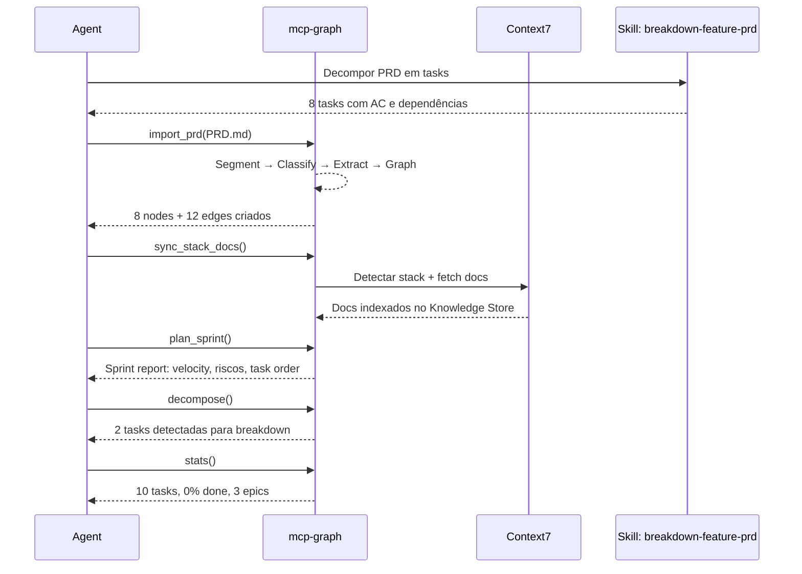
```mermaid
sequenceDiagram
    participant A as Agent
    participant MCP as mcp-graph
    participant C7 as Context7
    participant Skill as Skill: breakdown-feature-prd

    A->>Skill: Decompor PRD em tasks
    Skill-->>A: 8 tasks com AC e dependências
    A->>MCP: import_prd(PRD.md)
    MCP-->>MCP: Segment → Classify → Extract → Graph
    MCP-->>A: 8 nodes + 12 edges criados
    A->>MCP: sync_stack_docs()
    MCP->>C7: Detectar stack + fetch docs
    C7-->>MCP: Docs indexados no Knowledge Store
    A->>MCP: plan_sprint()
    MCP-->>A: Sprint report: velocity, riscos, task order
    A->>MCP: decompose()
    MCP-->>A: 2 tasks detectadas para breakdown
    A->>MCP: stats()
    MCP-->>A: 10 tasks, 0% done, 3 epics
```

**O que o import_prd faz automaticamente:**

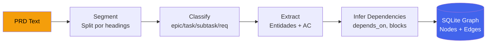
```mermaid
graph LR
    PRD[PRD Text] --> SEG[Segment<br/>Split por headings]
    SEG --> CLS[Classify<br/>epic/task/subtask/req]
    CLS --> EXT[Extract<br/>Entidades + AC]
    EXT --> DEP[Infer Dependencies<br/>depends_on, blocks]
    DEP --> GRAPH[(SQLite Graph<br/>Nodes + Edges)]

    style PRD fill:#f59e0b,color:#000
    style GRAPH fill:#4263eb,color:#fff
```

---

### Fase 4: IMPLEMENT — Executar com TDD

**Objetivo:** Implementar cada task seguindo Red → Green → Refactor.

**Skills:**
- `/subagent-driven-development` — Subagente fresh por task, review em dois estágios

**Sistemas:**
- **Code Intelligence** (nativo) — Analisar módulo alvo e dependency context do símbolo em implementação (via enriched-context)
- **Native Memories** (nativo) — Consultar memórias relevantes para o contexto da task
- **mcp-graph** — Rastrear status, fornecer contexto knowledge-aware

**Tools de contexto:**
- `context` / `rag_context` — Buscar contexto knowledge-aware antes de implementar (grafo + knowledge store + BM25)
- `enhanced-next` — Próxima task com knowledge coverage score (0-1) e velocity context
- `reindex_knowledge` — Rebuild indexes quando novo conteúdo é adicionado

**Protocolo:**

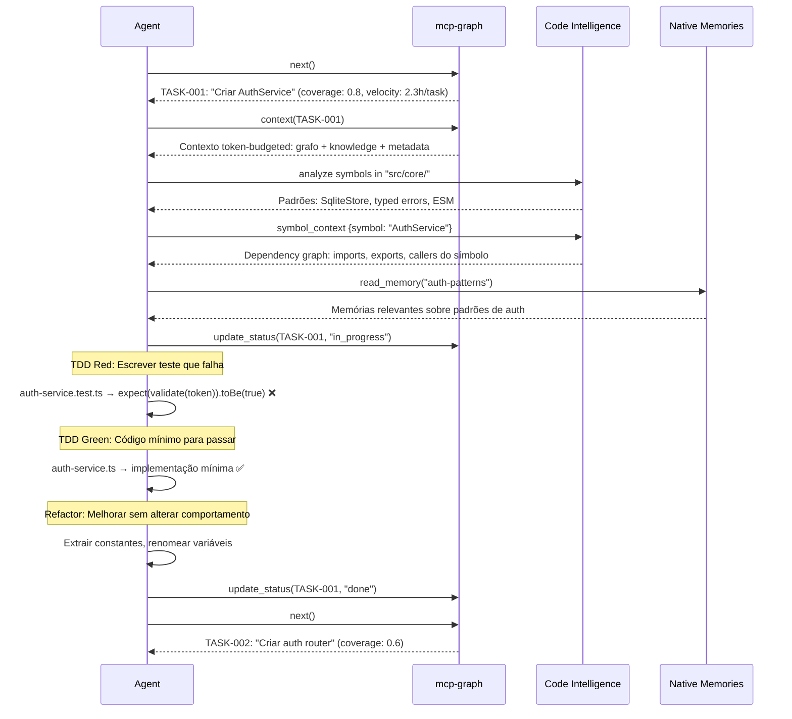
```mermaid
sequenceDiagram
    participant A as Agent
    participant MCP as mcp-graph
    participant CI as Code Intelligence
    participant Mem as Native Memories

    A->>MCP: next()
    MCP-->>A: TASK-001: "Criar AuthService" (coverage: 0.8, velocity: 2.3h/task)
    A->>MCP: context(TASK-001)
    MCP-->>A: Contexto token-budgeted: grafo + knowledge + metadata
    A->>CI: analyze symbols in "src/core/"
    CI-->>A: Padrões: SqliteStore, typed errors, ESM
    A->>CI: symbol_context {symbol: "AuthService"}
    CI-->>A: Dependency graph: imports, exports, callers do símbolo
    A->>Mem: read_memory("auth-patterns")
    Mem-->>A: Memórias relevantes sobre padrões de auth
    A->>MCP: update_status(TASK-001, "in_progress")

    Note over A: TDD Red: Escrever teste que falha
    A->>A: auth-service.test.ts → expect(validate(token)).toBe(true) ❌

    Note over A: TDD Green: Código mínimo para passar
    A->>A: auth-service.ts → implementação mínima ✅

    Note over A: Refactor: Melhorar sem alterar comportamento
    A->>A: Extrair constantes, renomear variáveis

    A->>MCP: update_status(TASK-001, "done")
    A->>MCP: next()
    MCP-->>A: TASK-002: "Criar auth router" (coverage: 0.6)
```

**Ferramentas de análise IMPLEMENT (via `analyze`):**
- `analyze(mode: "implement_done", nodeId)` — Definition of Done checklist (8 checks: 4 required + 4 recommended)
- `analyze(mode: "tdd_check")` — TDD adherence report com suggested test specs por AC
- `analyze(mode: "progress", sprint?)` — Sprint burndown + velocity trend + blockers + ETA

**`next` tool enriquecido:** Retorna `knowledgeCoverage`, `velocityContext`, e `tddHints` (suggested test names from AC) junto com a task recomendada.

**Definition of Done (DoD) — 8 checks:**
| # | Check | Severity | Lógica |
|---|-------|----------|--------|
| 1 | `has_acceptance_criteria` | required | Task ou parent tem AC |
| 2 | `ac_quality_pass` | required | AC score ≥ 60 (INVEST) |
| 3 | `no_unresolved_blockers` | required | Sem depends_on para nodes não-done |
| 4 | `status_flow_valid` | required | Passou por in_progress antes de done |
| 5 | `has_description` | recommended | Task tem descrição não-vazia |
| 6 | `not_oversized` | recommended | Não é L/XL sem subtasks |
| 7 | `has_testable_ac` | recommended | ≥1 AC é testável |
| 8 | `has_estimate` | recommended | xpSize ou estimateMinutes definido |

**Princípio Anti-Vibe-Coding:** Se o AI sugere feature sem teste → RECUSAR. Sempre Red primeiro.

---

### Fase 5: VALIDATE — Testes E2E

**Objetivo:** Validar que tudo funciona end-to-end com browser real.

**Skills (em sequência):**
1. `/playwright-explore-website` — Mapear UI, extrair seletores reais
2. `/playwright-generate-test` — Gerar `.spec.ts` a partir de cenários
3. `/playwright-tester-mode` — Rodar, diagnosticar, iterar até passar
4. `/e2e-testing` — Cobertura completa: visual regression, cross-browser

**Agents:**
- **Playwright MCP** — Automação de browser
- **mcp-graph** — `validate_task` wraps Playwright + auto-indexa conteúdo no Knowledge Store

**Tool `validate_task`:**
- Captura página via Playwright (HTML, screenshot, accessibility tree)
- Suporta **A/B comparison** com `compareUrl` (diff de conteúdo entre duas URLs)
- **CSS selector scoping** para extração direcionada
- Conteúdo capturado é auto-indexado no Knowledge Store (source type: `web_capture`)
- Evento `capture:completed` dispara reindex via `IntegrationOrchestrator`

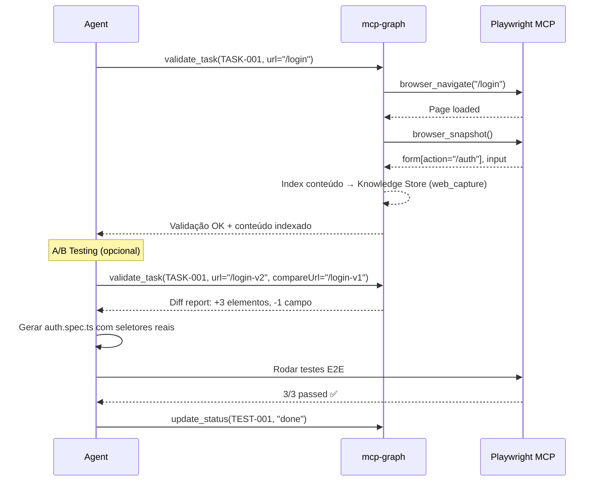
```mermaid
sequenceDiagram
    participant A as Agent
    participant MCP as mcp-graph
    participant PW as Playwright MCP

    A->>MCP: validate_task(TASK-001, url="/login")
    MCP->>PW: browser_navigate("/login")
    PW-->>MCP: Page loaded
    MCP->>PW: browser_snapshot()
    PW-->>MCP: form[action="/auth"], input#email, input#password
    MCP-->>MCP: Index conteúdo → Knowledge Store (web_capture)
    MCP-->>A: Validação OK + conteúdo indexado

    Note over A: A/B Testing (opcional)
    A->>MCP: validate_task(TASK-001, url="/login-v2", compareUrl="/login-v1")
    MCP-->>A: Diff report: +3 elementos, -1 campo

    A->>A: Gerar auth.spec.ts com seletores reais
    A->>PW: Rodar testes E2E
    PW-->>A: 3/3 passed ✅
    A->>MCP: update_status(TEST-001, "done")
```

---

### Fase 6: REVIEW — Qualidade e observabilidade

**Objetivo:** Garantir qualidade de código, segurança, e observabilidade.

**Skills:**
- `/code-reviewer` — Review profundo: qualidade + segurança
- `/code-review-checklist` — Checklist padronizado
- `/review-and-refactor` — Tech debt → refatorar agora, não depois
- `/log-standardization-framework` — Logs estruturados
- `/observability-engineer` — Métricas, health, SLOs

**Sistemas nativos:**
- **Code Intelligence** — Análise de padrões, inconsistências, impact analysis para verificar que mudanças não quebraram dependentes

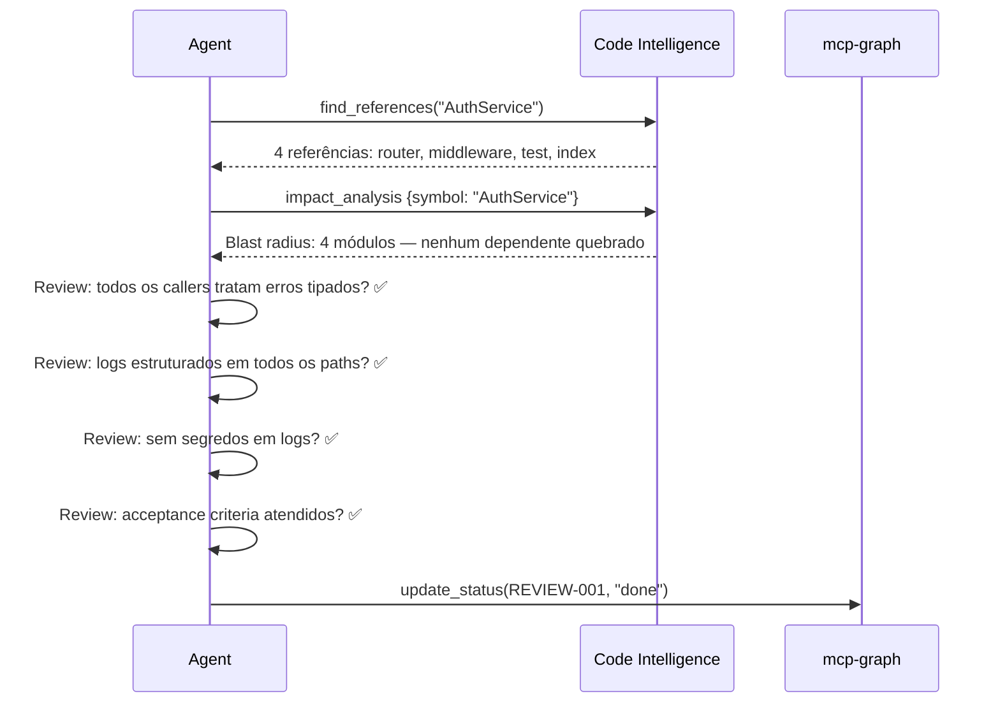
```mermaid
sequenceDiagram
    participant A as Agent
    participant CI as Code Intelligence
    participant MCP as mcp-graph

    A->>CI: find_references("AuthService")
    CI-->>A: 4 referências: router, middleware, test, index
    A->>CI: impact_analysis {symbol: "AuthService"}
    CI-->>A: Blast radius: 4 módulos — nenhum dependente quebrado
    A->>A: Review: todos os callers tratam erros tipados? ✅
    A->>A: Review: logs estruturados em todos os paths? ✅
    A->>A: Review: sem segredos em logs? ✅
    A->>A: Review: acceptance criteria atendidos? ✅
    A->>MCP: update_status(REVIEW-001, "done")
```

---

### Fase 7: HANDOFF — Entregar

**Objetivo:** Criar PR, atualizar docs, preparar demo.

**Protocolo mcp-graph:**
1. `update_status` do nó raiz (PRD) → `done`
2. `export_graph` → salvar snapshot em `docs/`

**Saída:** PR criado, documentação atualizada, grafo exportado.

---

### Fase 8: LISTENING — Feedback loop

**Objetivo:** Demo para stakeholders, coletar feedback, alimentar próxima iteração.

**Protocolo mcp-graph:**
- Cada feedback → `node { action: "add" }` com tipo `task` ou `requirement`
- Volta para ANALYZE com contexto acumulado

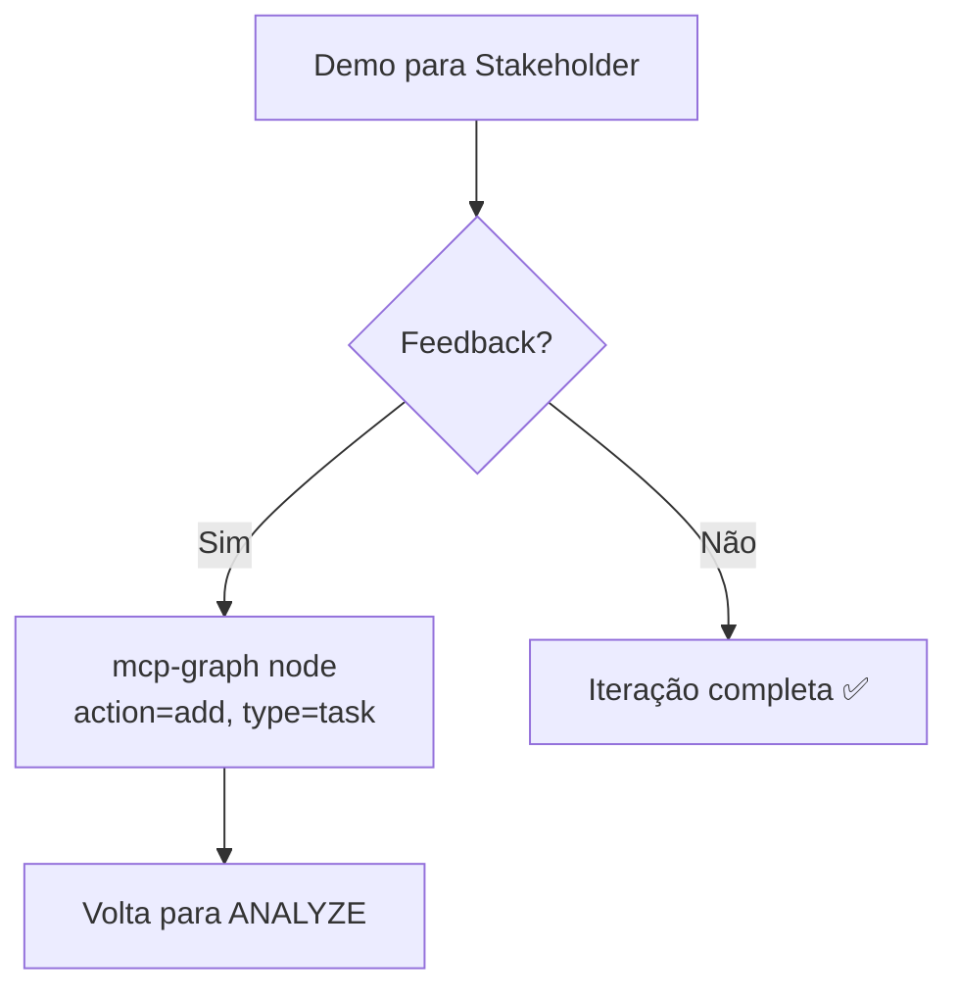
```mermaid
graph TD
    DEMO[Demo para Stakeholder] --> FB{Feedback?}
    FB --> |Sim| ADD[mcp-graph node<br/>action=add, type=task]
    ADD --> ANALYZE[Volta para ANALYZE]
    FB --> |Não| DONE[Iteração completa ✅]
```

---

## Mapa de Skills por Fase

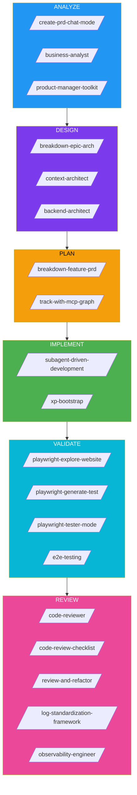
```mermaid
graph TB
    subgraph "ANALYZE"
        S1[/create-prd-chat-mode/]
        S2[/business-analyst/]
        S3[/product-manager-toolkit/]
    end

    subgraph "DESIGN"
        S4[/breakdown-epic-arch/]
        S5[/context-architect/]
        S6[/backend-architect/]
    end

    subgraph "PLAN"
        S7[/breakdown-feature-prd/]
        S8[/track-with-mcp-graph/]
    end

    subgraph "IMPLEMENT"
        S9[/subagent-driven-development/]
        S10[/xp-bootstrap/]
    end

    subgraph "VALIDATE"
        S11[/playwright-explore-website/]
        S12[/playwright-generate-test/]
        S13[/playwright-tester-mode/]
        S14[/e2e-testing/]
    end

    subgraph "REVIEW"
        S15[/code-reviewer/]
        S16[/code-review-checklist/]
        S17[/review-and-refactor/]
        S18[/log-standardization-framework/]
        S19[/observability-engineer/]
    end

    ANALYZE --> DESIGN --> PLAN --> IMPLEMENT --> VALIDATE --> REVIEW

    style ANALYZE fill:#2196f3,color:#fff
    style DESIGN fill:#7c3aed,color:#fff
    style PLAN fill:#f59e0b,color:#000
    style IMPLEMENT fill:#4caf50,color:#fff
    style VALIDATE fill:#06b6d4,color:#fff
    style REVIEW fill:#ec4899,color:#fff
```

---

## Modelo de Dados do Grafo

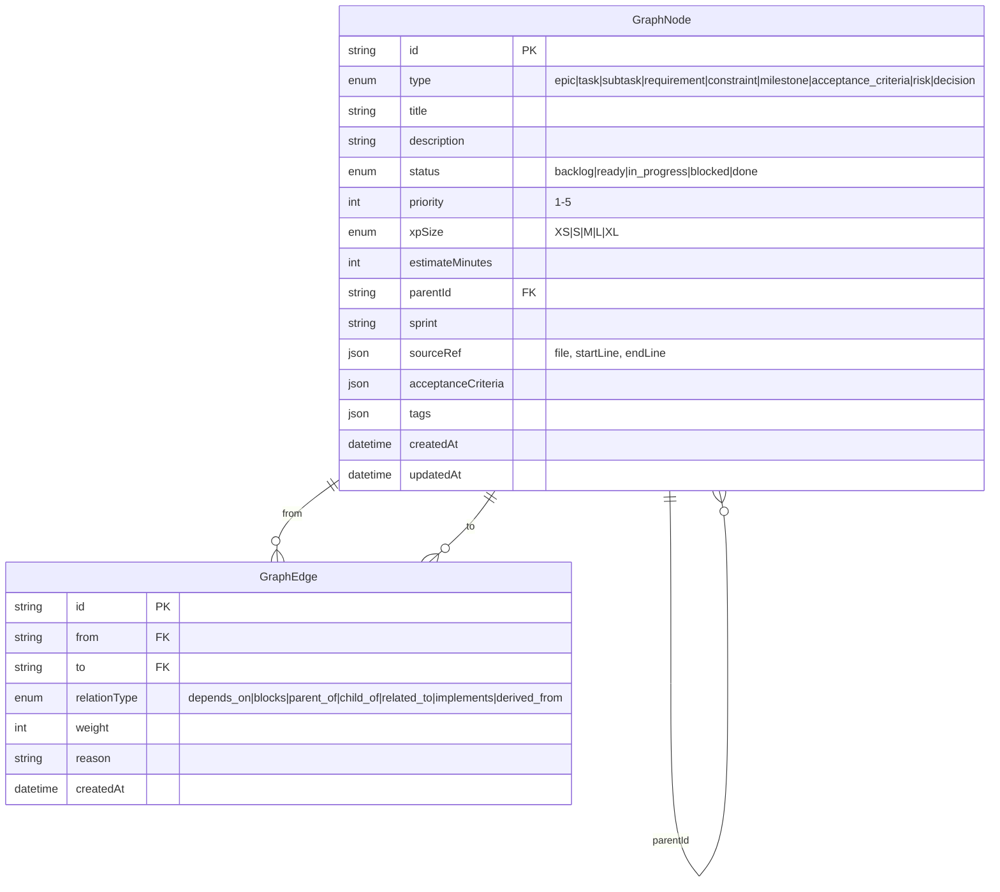
```mermaid
erDiagram
    GraphNode {
        string id PK
        enum type "epic|task|subtask|requirement|constraint|milestone|acceptance_criteria|risk|decision"
        string title
        string description
        enum status "backlog|ready|in_progress|blocked|done"
        int priority "1-5"
        enum xpSize "XS|S|M|L|XL"
        int estimateMinutes
        string parentId FK
        string sprint
        json sourceRef "file, startLine, endLine"
        json acceptanceCriteria
        json tags
        datetime createdAt
        datetime updatedAt
    }

    GraphEdge {
        string id PK
        string from FK
        string to FK
        enum relationType "depends_on|blocks|parent_of|child_of|related_to|implements|derived_from"
        int weight
        string reason
        datetime createdAt
    }

    GraphNode ||--o{ GraphEdge : "from"
    GraphNode ||--o{ GraphEdge : "to"
    GraphNode ||--o{ GraphNode : "parentId"
```

---

## Hierarquia de Tarefas

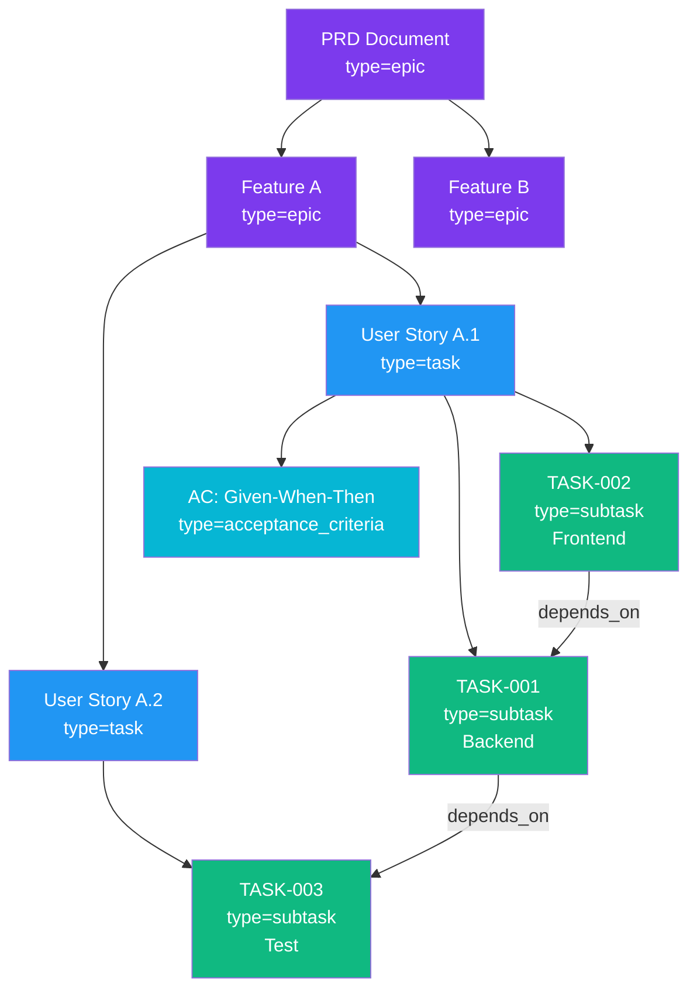
```mermaid
graph TD
    PRD[PRD Document<br/>type=epic] --> F1[Feature A<br/>type=epic]
    PRD --> F2[Feature B<br/>type=epic]

    F1 --> US1[User Story A.1<br/>type=task]
    F1 --> US2[User Story A.2<br/>type=task]

    US1 --> T1[TASK-001<br/>type=subtask<br/>Backend]
    US1 --> T2[TASK-002<br/>type=subtask<br/>Frontend]
    US2 --> T3[TASK-003<br/>type=subtask<br/>Test]

    T1 --> |depends_on| T3
    T2 --> |depends_on| T1

    AC1[AC: Given-When-Then<br/>type=acceptance_criteria]
    US1 --> AC1

    style PRD fill:#7c3aed,color:#fff
    style F1 fill:#7c3aed,color:#fff
    style F2 fill:#7c3aed,color:#fff
    style US1 fill:#2196f3,color:#fff
    style US2 fill:#2196f3,color:#fff
    style T1 fill:#10b981,color:#fff
    style T2 fill:#10b981,color:#fff
    style T3 fill:#10b981,color:#fff
    style AC1 fill:#06b6d4,color:#fff
```

---

## Comandos mcp-graph por Fase

| Fase | Comando | Propósito |
|------|---------|-----------|
| **Início** | `list`, `stats`, `doctor` | Verificar estado atual e saúde do ambiente |
| **PLAN** | `import_prd` | Parse PRD → nodes + edges |
| **PLAN** | `plan_sprint` | Sprint planning com velocity e riscos |
| **PLAN** | `decompose` | Detectar tasks para breakdown |
| **PLAN** | `sync_stack_docs` | Sincronizar docs da stack via Context7 |
| **PLAN** | `node`, `edge` | Criar tarefas manualmente |
| **DESIGN** | Code Intelligence `impact_analysis` | Blast radius analysis de símbolo antes de definir arquitetura |
| **IMPLEMENT** | `next` | Próxima task knowledge-aware (coverage + velocity) |
| **IMPLEMENT** | `context`, `rag_context` | Contexto token-budgeted para task atual |
| **IMPLEMENT** | Code Intelligence `symbol_context` | Dependency graph do símbolo em implementação |
| **IMPLEMENT** | `reindex_knowledge` | Rebuild indexes de todas as fontes |
| **IMPLEMENT** | `update_status → in_progress` | Marcar início |
| **IMPLEMENT** | `update_status → done` | Marcar conclusão |
| **VALIDATE** | `validate` | Validação browser (action: task) + AC quality (action: ac) |
| **REVIEW** | Code Intelligence `impact_analysis` | Verificar blast radius das mudanças no review |
| **REVIEW** | `export_graph`, `export_mermaid` | Exportar para visualização |
| **HANDOFF** | `update_status (bulk) → done` | Fechar PRD |
| **LISTENING** | `node` | Registrar feedback (action: add) |

---

## Code Intelligence Enforcement Automático

Além das sugestões, o Code Intelligence pode ser **automaticamente enforced** via `code-intelligence-wrapper.ts`. Quando ativado, toda resposta MCP inclui um bloco `_code_intelligence` com:
- **Index status** — disponibilidade e staleness do índice
- **Enrichment phase-aware** — IMPLEMENT (impact analysis depth 2), REVIEW (blast radius depth 3), VALIDATE (symbol context 1-hop)
- **Warnings** — índice vazio, stale, sem símbolos relevantes

Ativar: `set_phase { codeIntelligence: "strict" }` (ou `"advisory"` / `"off"`).

## Tool Prerequisites Enforcement

O sistema de pré-requisitos obrigatórios garante que tools essenciais (como `rag_context`, `context`, `analyze`) sejam efetivamente utilizadas antes de ações críticas. Enforced via `lifecycle-wrapper.ts` — rastreia chamadas de tools por node e bloqueia (strict) ou avisa (advisory) se pré-requisitos não foram cumpridos.

### Modos

Ativar: `set_phase { prerequisites: "strict" }` (ou `"advisory"` / `"off"`).

| Mode | Behavior |
|------|----------|
| `strict` | **Bloqueia** tools se pré-requisitos obrigatórios não foram chamados |
| `advisory` | **Avisa** mas não bloqueia (default) |
| `off` | Desabilita enforcement |

### Regras por Fase

| Fase | Trigger | Pré-requisitos | Scope |
|------|---------|---------------|-------|
| DESIGN | `set_phase(PLAN)` | `analyze(design_ready)` | project |
| PLAN | `set_phase(IMPLEMENT)` | `sync_stack_docs` + `plan_sprint` | project |
| IMPLEMENT | `update_status(in_progress)` | `next` | project |
| IMPLEMENT | `update_status(done)` | `context` + `rag_context` + `analyze(implement_done)` | node |
| VALIDATE | `update_status(done)` | `validate` + `analyze(validate_ready)` | mixed |
| REVIEW | `set_phase(HANDOFF)` | `analyze(review_ready)` + `export` | project |
| HANDOFF | `set_phase(LISTENING)` | `analyze(handoff_ready)` + `snapshot` + `write_memory` | project |

### Full Enforcement

Para enforcement máximo, combinar todos os 3 layers:
```
set_phase { mode: "strict", codeIntelligence: "strict", prerequisites: "strict" }
```

## Sugestões de MCPs Externos por Fase (Lifecycle Wrapper)

O lifecycle wrapper (`_lifecycle` block) agora sugere automaticamente sistemas contextuais via `suggestedMcpAgents`. Cada fase do ciclo indica quais agents/sistemas usar e com quais tools:

| Fase | Native Memories | Code Intelligence | Context7 | Playwright |
|------|----------------|-------------------|----------|------------|
| **ANALYZE** | — | — | — | — |
| **DESIGN** | — | `search_symbols`, `impact_analysis` | — | — |
| **PLAN** | — | — | `resolve-library-id`, `query-docs` | — |
| **IMPLEMENT** | `write_memory`, `read_memory` | `search_symbols`, `impact_analysis`, `symbol_context` | `query-docs` | — |
| **VALIDATE** | — | — | — | `browser_navigate`, `browser_snapshot`, `browser_click` |
| **REVIEW** | `read_memory` | `impact_analysis`, `find_references` | — | — |
| **HANDOFF** | `write_memory` | — | — | — |
| **LISTENING** | — | — | — | — |

Exemplo de `_lifecycle` response com sugestões:

```json
{
  "_lifecycle": {
    "phase": "IMPLEMENT",
    "suggestedMcpAgents": [
      { "name": "memories", "action": "Consultar/gravar memórias do projeto", "tools": ["write_memory", "read_memory"] },
      { "name": "code-intelligence", "action": "Impact analysis antes de editar", "tools": ["impact_analysis", "symbol_context"] },
      { "name": "context7", "action": "Consultar API docs das libs", "tools": ["query-docs"] }
    ]
  }
}
```

---

## Princípios XP Anti-Vibe-Coding

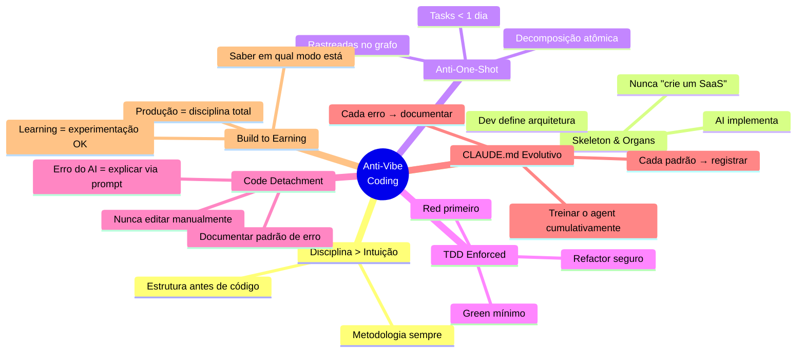
```mermaid
mindmap
  root((Anti-Vibe<br/>Coding))
    Disciplina > Intuição
      Estrutura antes de código
      Metodologia sempre
    Skeleton & Organs
      Dev define arquitetura
      AI implementa
      Nunca "crie um SaaS"
    Anti-One-Shot
      Decomposição atômica
      Tasks < 1 dia
      Rastreadas no grafo
    TDD Enforced
      Red primeiro
      Green mínimo
      Refactor seguro
    Code Detachment
      Erro do AI = explicar via prompt
      Nunca editar manualmente
      Documentar padrão de erro
    CLAUDE.md Evolutivo
      Cada erro → documentar
      Cada padrão → registrar
      Treinar o agent cumulativamente
    Build to Earning
      Produção = disciplina total
      Learning = experimentação OK
      Saber em qual modo está
```

---

## Fluxo Completo — Exemplo Prático

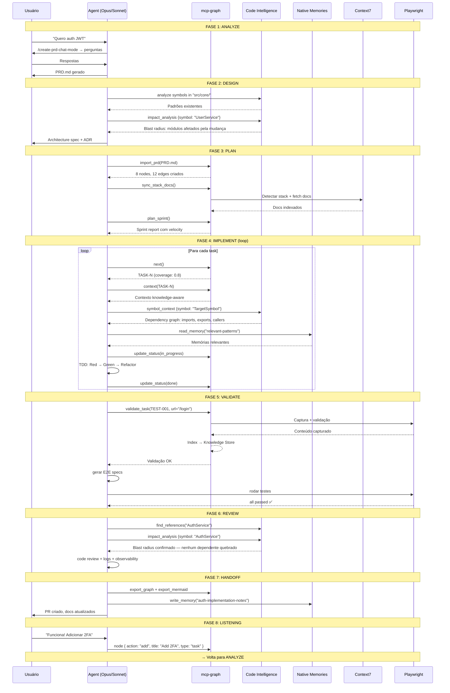
```mermaid
sequenceDiagram
    participant U as Usuário
    participant A as Agent (Opus/Sonnet)
    participant MCP as mcp-graph
    participant CI as Code Intelligence
    participant Mem as Native Memories
    participant C7 as Context7
    participant PW as Playwright

    Note over U,PW: FASE 1: ANALYZE
    U->>A: "Quero auth JWT"
    A->>U: /create-prd-chat-mode → perguntas
    U->>A: Respostas
    A->>U: PRD.md gerado

    Note over U,PW: FASE 2: DESIGN
    A->>CI: analyze symbols in "src/core/"
    CI-->>A: Padrões existentes
    A->>CI: impact_analysis {symbol: "UserService"}
    CI-->>A: Blast radius: módulos afetados pela mudança
    A->>U: Architecture spec + ADR

    Note over U,PW: FASE 3: PLAN
    A->>MCP: import_prd(PRD.md)
    MCP-->>A: 8 nodes, 12 edges criados
    A->>MCP: sync_stack_docs()
    MCP->>C7: Detectar stack + fetch docs
    C7-->>MCP: Docs indexados
    A->>MCP: plan_sprint()
    MCP-->>A: Sprint report com velocity

    Note over U,PW: FASE 4: IMPLEMENT (loop)
    loop Para cada task
        A->>MCP: next()
        MCP-->>A: TASK-N (coverage: 0.8)
        A->>MCP: context(TASK-N)
        MCP-->>A: Contexto knowledge-aware
        A->>CI: symbol_context {symbol: "TargetSymbol"}
        CI-->>A: Dependency graph: imports, exports, callers
        A->>Mem: read_memory("relevant-patterns")
        Mem-->>A: Memórias relevantes
        A->>MCP: update_status(in_progress)
        A->>A: TDD: Red → Green → Refactor
        A->>MCP: update_status(done)
    end

    Note over U,PW: FASE 5: VALIDATE
    A->>MCP: validate_task(TEST-001, url="/login")
    MCP->>PW: Captura + validação
    PW-->>MCP: Conteúdo capturado
    MCP-->>MCP: Index → Knowledge Store
    MCP-->>A: Validação OK
    A->>A: gerar E2E specs
    A->>PW: rodar testes
    PW-->>A: all passed ✅

    Note over U,PW: FASE 6: REVIEW
    A->>CI: find_references("AuthService")
    A->>CI: impact_analysis {symbol: "AuthService"}
    CI-->>A: Blast radius confirmado — nenhum dependente quebrado
    A->>A: code review + logs + observability

    Note over U,PW: FASE 7: HANDOFF
    A->>MCP: export_graph + export_mermaid
    A->>Mem: write_memory("auth-implementation-notes")
    A->>U: PR criado, docs atualizados

    Note over U,PW: FASE 8: LISTENING
    U->>A: "Funciona! Adicionar 2FA"
    A->>MCP: node { action: "add", title: "Add 2FA", type: "task" }
    Note over U,PW: → Volta para ANALYZE
```

---

## Ecossistema de Skills

### Organização por Disciplina

| Disciplina | Skills | Fases |
|------------|--------|-------|
| **Agents** (21) | dev-flow-orchestrator, xp-bootstrap, subagent-driven-development, track-with-mcp-graph, create-prd-chat-mode, breakdown-epic-arch, breakdown-feature-prd, project-scaffold, ... | Todas |
| **Code Review** (8) | code-reviewer, code-review-checklist, review-and-refactor, code-review-excellence, ... | REVIEW |
| **Testing** (22+) | playwright-explore-website, playwright-generate-test, playwright-tester-mode, e2e-testing, breakdown-test, ... | VALIDATE |
| **Observability** (12+) | log-standardization-framework, log-architecture-enforcement, observability-engineer, distributed-tracing, ... | REVIEW |
| **Security** (14) | OWASP scanning, pentesting, vulnerability analysis, ... | REVIEW |
| **Software Quality** (16+) | C4 architecture, ADR generator, design patterns, ... | DESIGN |

### Como Skills São Carregados

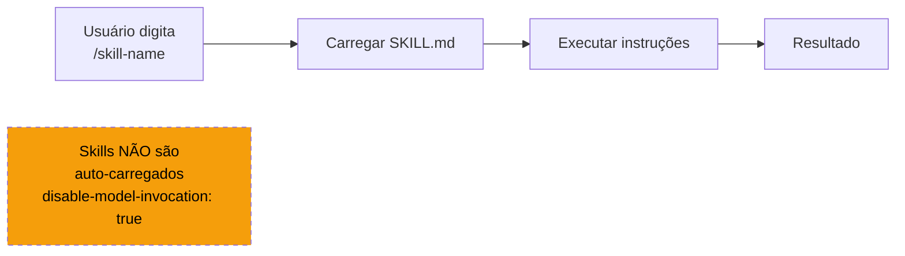
```mermaid
graph LR
    USER[Usuário digita<br/>/skill-name] --> LOAD[Carregar SKILL.md]
    LOAD --> EXEC[Executar instruções]
    EXEC --> RESULT[Resultado]

    NOTE[Skills NÃO são<br/>auto-carregados<br/>disable-model-invocation: true]

    style NOTE fill:#f59e0b,color:#000,stroke-dasharray: 5 5
```

**Anatomia de um Skill:**

```
skills/
  agents/
    dev-flow-orchestrator/
      SKILL.md          ← Instruções completas
  code-review/
    code-reviewer/
      SKILL.md
  testing/
    e2e-testing/
      SKILL.md
  ...
```

Cada `SKILL.md` contém:
- **Frontmatter:** nome, descrição, categoria, risco
- **Use this skill when:** Quando usar
- **Do not use when:** Quando NÃO usar
- **Instructions:** Passos detalhados com exemplos

---

## Verificação (Definition of Done)

Antes de marcar qualquer task como `done`:

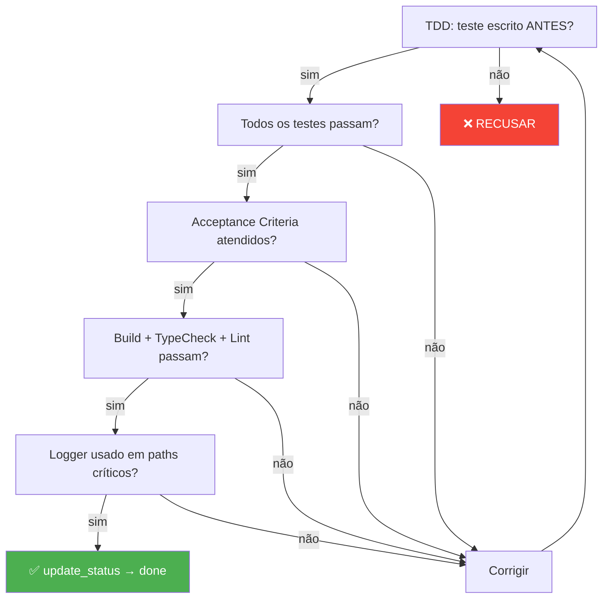
```mermaid
graph TD
    TDD[TDD: teste escrito ANTES?] --> |sim| TESTS[Todos os testes passam?]
    TDD --> |não| FAIL[❌ RECUSAR]
    TESTS --> |sim| AC[Acceptance Criteria atendidos?]
    TESTS --> |não| FIX[Corrigir]
    AC --> |sim| BUILD[Build + TypeCheck + Lint passam?]
    AC --> |não| FIX
    BUILD --> |sim| LOGS[Logger usado em paths críticos?]
    BUILD --> |não| FIX
    LOGS --> |sim| DONE[✅ update_status → done]
    LOGS --> |não| FIX
    FIX --> TDD

    style DONE fill:#4caf50,color:#fff
    style FAIL fill:#f44336,color:#fff
```

---

## Resumo

O mcp-graph não é apenas um task tracker. É o **Hub de Inteligência Local** — motor de execução com 30 tools MCP que:

1. **Parseia PRDs** automaticamente em grafos de dependência
2. **Orquestra 3 MCPs + 2 sistemas nativos** (mcp-graph, Context7, Playwright + Native Memories, Code Intelligence) via `IntegrationOrchestrator` event-driven
3. **Garante disciplina** via TDD, code review, e definition of done
4. **Preserva contexto** entre sessões (SQLite persistente + Knowledge Store)
5. **Economiza tokens** com tiered context compression (70-85% redução) e token budgeting (60/30/10)
6. **Visualiza progresso** em dashboard interativo (React 19 + Tailwind + React Flow)
7. **Acumula conhecimento** de múltiplas fontes (native memories, docs, web captures) com RAG pipeline 100% local

> **Princípio fundamental:** O desenvolvedor define o QUE e o COMO (arquitetura). O AI executa com disciplina. Nunca o contrário.
